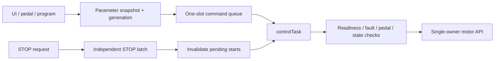

# Process flow analysis — v2.2.0

Updated 3 October 2026. This document describes current production flow; the [earlier analysis is archived](docs/archive/PROCESS_ANALYSIS_v2.0.5.md). Physical response times require measurement.

## Task architecture

| Task | Core | Priority | Stack | Responsibility |
| --- | --- | --- | --- | --- |
| safetyTask | 0 | 5 | 4 KB | Fault polling, E-STOP debounce, driver alarm, watchdog |
| inputTask | 0 | 4 | 5 KB | GPIO/ADC sampling, pedal interlock and coherent input publication |
| controlTask | 0 | 3 | 4 KB | Motion commands, STOP latch, mode state, settings application, fault cleanup/reset |
| lvglTask | 1 | 2 | 64 KB | Actual LVGL screens, touch, dimming, blocking fault overlay |
| storageTask | 1 | 1 | 12 KB | Debounced NVS writes/retries and housekeeping |
| usbMirrorTask, optional | 1 | 1 | 8 KB | Bounded pixel transport and gated remote pointer input |

Task creation is checked. Motion stays inhibited until four critical tasks report ready. Watchdog setup, registration and feed failures are checked. Storage/UI are not watchdog subscribers; input/control/safety are. FastAccelStepper has its own Core 0 task at priority 24; the table lists application tasks. RMT channel allocation also runs on Core 0 during boot. Task priorities do not establish a physical latency guarantee.

## Motion dispatch and STOP

Runtime motor calls belong to controlTask; inputTask publishes sampled inputs and UI reads coherent control snapshots. Commands are received once before dispatch. STOP is not overwritten by START; it invalidates older start tickets. JOG release cancels queued JOG and active JOG requires UI renewal within 150 ms. These software intervals are not measurements of physical standstill.

Motor configuration applies through controlTask only while idle. UI reports applied/cancelled and storage status rather than claiming persistence immediately. Program start snapshots parameters; program speed/direction ownership does not depend on an untouched panel's static RPM difference.

## Pedal and speed input

Pedal arming requires 50 ms stable release at boot, enable and reset. Release cancels the pedal's pending start. Active analog input requires a valid, fresh sample; stale/failed enabled pedal input blocks motion instead of selecting the panel. With no ADS1115 detected at boot, an enabled pedal runs switch-only (GPIO33 start/stop, panel-pot speed); a detected ADS1115 that stops delivering fresh samples still blocks motion. ADS1115 conversion polling is split across task cycles.

Calculated RPM comes from step timing and geometry, not an encoder. Source/direction are visible on the main screen. Idle-screen RPM +/− and direction controls are disabled during motion; the physical direction switch retains priority when enabled.

## E-STOP and driver alarm

GPIO34 expects HIGH healthy / LOW fault. A FALLING ISR writes ENA HIGH and stores pending/wake flags. As a redundant channel, the safety task also polls the pin level every millisecond, so a sustained LOW latches through the same 5 ms confirm path even if the edge never reached the ISR. ISR avoids motor calls, logging, allocation and ordinary flash functions. ENA HIGH disable is a driver/interface assumption that must be verified.

The safety task also supervises task liveness: a stale control cycle (FAULT_CONTROL_STALE) or a stale input-task heartbeat (FAULT_INPUT_STALE, 100 ms) inhibits ENA directly, because the motion-gate stop is consumed by the task that may have hung. Driver ALM inhibits ENA on the first LOW sample; its 5 ms filter only classifies the latched fault. Every latched fault disarms the USB mirror; re-arming is local to the touchscreen. A dead GT911 (HMI_REQUIRED_FOR_MOTION) or a pending restart after formatting blocks new motion through the same admission gate.

The safety task publishes a latched ESTOP transition; potentially blocking motor cleanup runs in controlTask. Driver-alarm handling disables ENA first. Only the control task performs and retries library cleanup; reset remains blocked until the asynchronous FastAccelStepper queue drains. A brief input glitch also remains faulted until explicit reset.

The overlay displays fault/input state, wakes the backlight and blocks underlying controls. RESET TO IDLE is available only when physical input/alarm/pedal conditions permit it; callback and control processing both guard reset. Reset never starts motion.

No ISR-cycle count or physical stop-time guarantee is asserted. Repeated software checks do not make GPIO enable atomic with an interrupt. Verify wiring, cable breaks, driver enable polarity and timing on the assembled machine using the [measurement procedure](docs/estop_timing.md).

## SAVE operation

1. UI updates a guarded draft/settings snapshot and requests a deferred save.
2. `SaveRequest` records a generation; settings debounce for 1000 ms and presets for 500 ms.
3. storageTask serializes snapshots and writes NVS `wrot/cfg` or `wrot/prs`.
4. Success clears only the completed generation; a concurrent new request remains pending.
5. Failure retains pending data, reports error and retries with backoff up to 30 seconds.

UI distinguishes pending/saved/error. Invalid existing JSON roots and out-of-range/nonfinite values are validated; corrupt stored data does not silently become a successful boot. Dimming uses 16 bits and documented 44→300 migration.

Flash commits may interfere with rendering/cache access. `g_flashWriting` signals active writes; the UI loop checks it, although this flag is not a hardware cache-safety proof. Framework configuration, ISR placement and worst-case flash/load behavior still require bench checks.

## Screen, theme and input lifecycle

Navigation requests and theme recreation are deferred through the UI loop, outside callback deletion of triggering widgets. Static widget pointers are invalidated before screen reconstruction. Program draft lifetime is separate from screen widgets, preserving edits across child screens.

V5 shares a graphite/orange theme, 14 px body floor and generated 104 px numeric font across firmware/simulator. Twenty-three ScreenIds and a separate fault overlay are registered. Calibration uses fixed Align → Measure → Verify → Save stages; measured and verification moves must complete, and only a verified draft with its save receipt becomes persistent. Setup adds a four-stage wizard. New/Edit Program uses fixed positions, separate run/available modes and full-screen validated name/RPM input. GT911 read failure reports RELEASED, and JOG renewal protects against stalled UI input.

## USB mirror

Mirror firmware sends dirty RGB565 rectangles through bounded writes. Failed transport disarms/releases remote input and requests redraw after dropped regions. Remote interaction requires physical-screen arming and valid keepalive; no direct motor-command protocol exists.

## Verification and remaining work

Local validation passed 438 native/production-control cases, six packaging regressions, actual upstream RMT encoder profiles, actual LVGL self-test, a zero-failure layout audit and release/debug/mirror compilation. Publication requires all six CI jobs on the exact tagged master commit. Tests directly cover several production policies; older suites model other behavior and simulator motor/storage are stubbed. Device fault injection, physical stop response, power loss, cable-break behavior, USB backpressure and TIG HF conditions remain separate checks. See [FastAccelStepper re-audit](docs/FASTACCELSTEPPER_1_4_REAUDIT.md), [control/calibration implementation](docs/CONTROL_SETUP_IMPLEMENTATION.md), [current status](STATUS.md), [hardware guide](docs/HARDWARE_SETUP.md) and [flashing guide](docs/releases/FLASHING.md).
