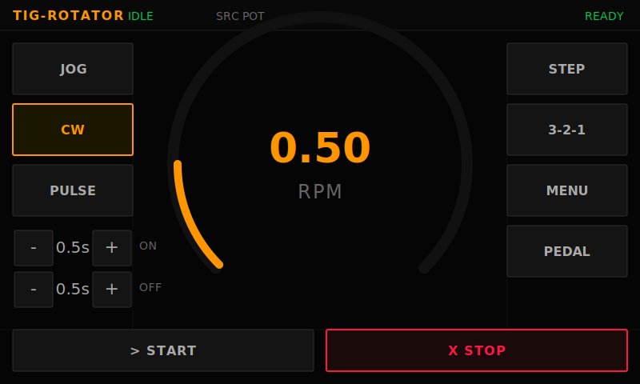
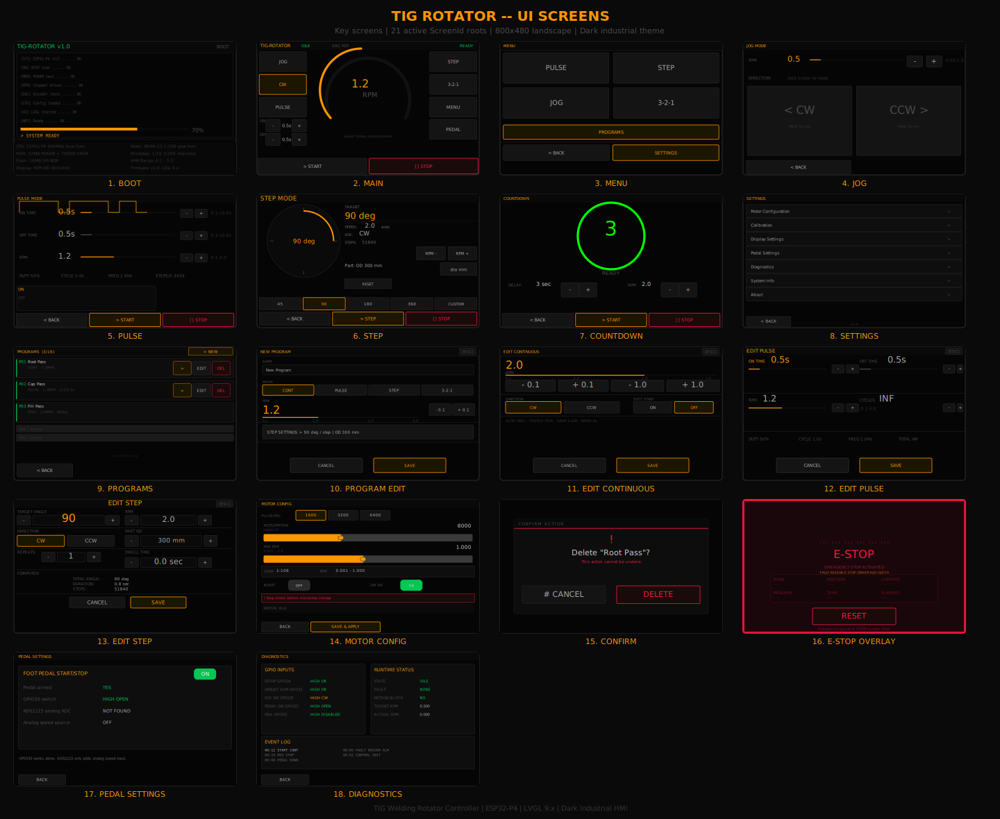
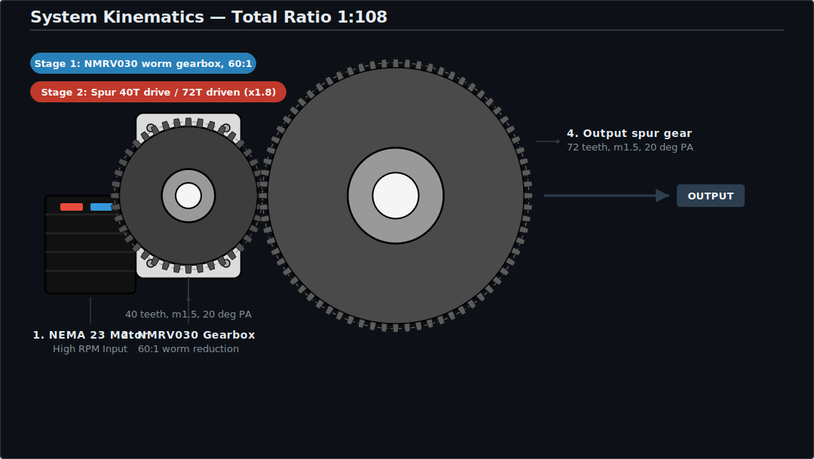
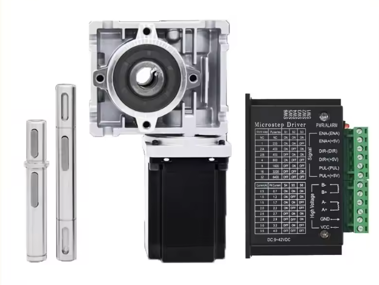
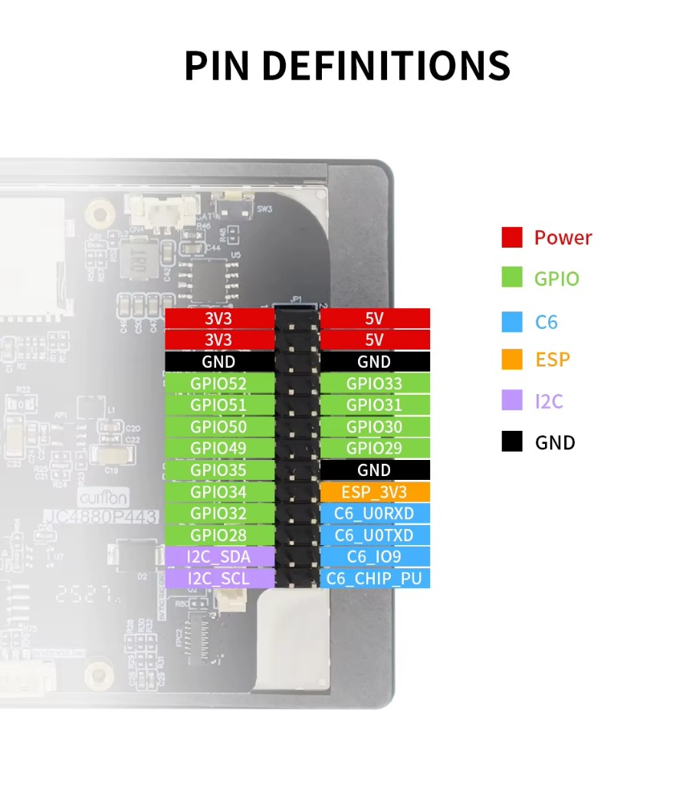
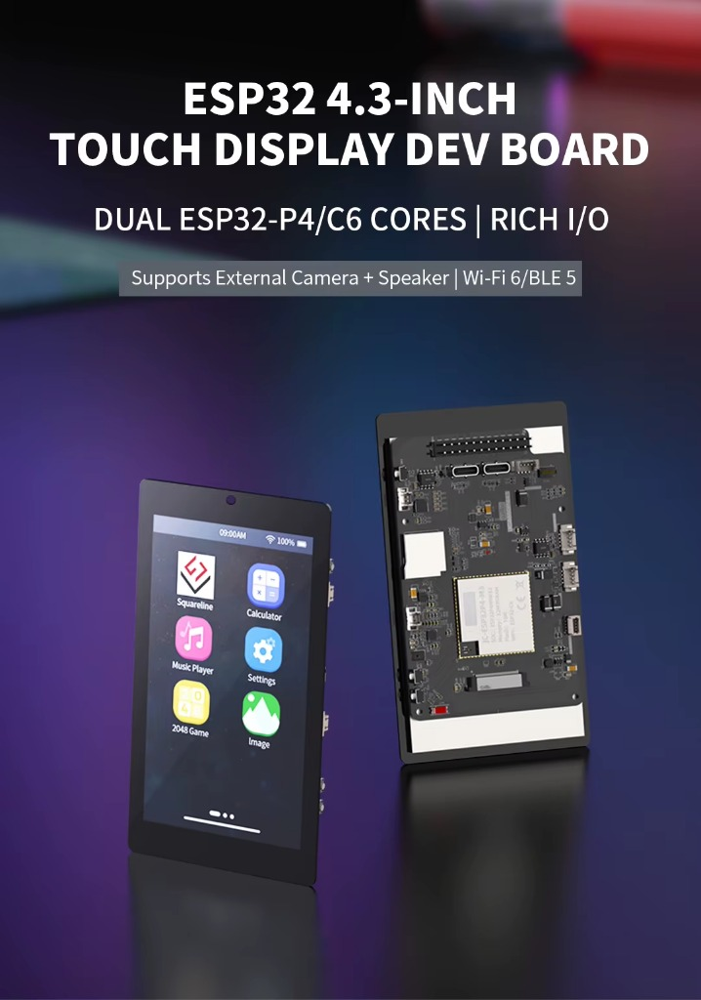

<div align="center">

# DIY Welding Positioner Controller

### Precision Multi-Mode Welding Rotator for TIG, MIG, and Pipe Welding

**ESP32-P4 &nbsp;&middot;&nbsp; Firmware v2.0.4**

<sub>GUITION JC4880P443C 4.3" touch display board.</sub>

<br>





<br>

Open-source welding positioner controller with a glove-safe industrial touch UI built on dual-core FreeRTOS.

<br>

[](#)
[](https://opensource.org/licenses/MIT)
[](https://espressif.com/)
[](https://docs.espressif.com/)
[](https://lvgl.io/)
[](https://platformio.org/)

<br>

*If this project helped you build something, consider giving it a star.*

</div>

<br>

---

## Table of Contents

- [Quick Start](#quick-start)
- [Demo](#demo)
- [Features](#features)
- [UI Screens](#ui-screens)
- [Architecture](#industrial-rtos-architecture)
- [Gear System & Wiring](#gear-system)
- [Bill of Materials](#bill-of-materials)
- [Performance Specifications](#performance-specifications)
- [Welding Modes](#welding-modes)
- [Configuration](#configuration)
- [Persistence (NVS)](#persistence-nvs)
- [Safety Notice](#safety-notice)
- [Troubleshooting](#troubleshooting)
- [Roadmap](#roadmap)
- [Project Structure](#project-structure)
- [License](#license)

---

## Quick Start

1. **Clone the repository:**

   ```bash
   git clone https://github.com/catorendal-a11y/DIY-Welding-Positioner-ESP32-P4.git
   cd DIY-Welding-Positioner-ESP32-P4
   ```

2. **Open in VS Code** with the **PlatformIO** extension installed.

3. **Select board environment:** `esp32p4-release` (GUITION JC4880P443C 4.3")

4. **Build and flash:**

   ```bash
   pio run -t upload
   ```

   Debug build with verbose serial logging:

   ```bash
   pio run -t upload -e esp32p4-debug
   ```

5. **Connect hardware** per the [wiring diagram](#wiring-diagram) below.

---

## Demo

Watch the system in action — UI interaction, motor rotation, screen navigation, E-STOP, direction switch, and pot control.

<div align="center">

[](https://youtu.be/GygLl6XY-TM)

</div>

---

## Features

| Category | Details |
|:---|:---|
| **Welding Modes** | 5 modes — Continuous, Jog, Pulse, Step, and Countdown (configurable 1-10s delay) |
| **Speed Control** | Live RPM via **potentiometer** on the main screen; touch **+/-** on **Jog** (and presets/settings where applicable) |
| **Foot Pedal** | Analog speed input (via ADS1115 I2C ADC) + digital start switch |
| **Direction Switch** | Physical CW/CCW toggle (GPIO 29) |
| **Touch UI** | LVGL 9.x glove-safe interface, high-contrast dark theme, 8 accent colors |
| **Program Presets** | Save/load up to 16 welding parameter sets to **NVS** (flash, JSON blobs) |
| **Motor Config** | Microstepping (1/4 – 1/32), acceleration, calibration, direction invert |
| **Display Settings** | Brightness slider, dim timeout, theme color selection |
| **System Info** | Live CPU core load, free heap, PSRAM usage, uptime |
| **Hardware Safety** | NC E-STOP interrupt (<0.5 ms), software watchdog, CAS state transitions; dimmed backlight wakes on ESTOP |
| **Thread Safety** | Mutex-protected stepper access, atomic cross-core variables, pending-flag patterns |

---

## UI Screens

The interface is built from many full-screen flows and editors—each purpose-built for industrial use with glove-safe touch targets (see `docs/images/ui_screens.svg` for the full visual map). In firmware, root views are registered as **`ScreenId` values** in `src/ui/screens.h`: there are **19** distinct roots from `SCREEN_MAIN` through `SCREEN_ABOUT` (including boot, confirm, preset editors, settings hub, modes, programs, calibration, motor config, display, about, etc.), plus a separate full-screen **E-STOP overlay** module that is not a `ScreenId` but can appear over any active screen. Older documentation sometimes referred to a larger “screen count” when counting every mockup panel separately; the numbers above match the current C++ registry.

| Screen | Description |
|:---|:---|
| **Boot** | Startup splash / transition to main |
| **Main** | Large RPM gauge (pot-driven), start/stop, mode quick-access (no main-screen RPM +/-) |
| **Menu** | Advanced mode selection and settings |
| **Continuous** | Constant rotation at set RPM |
| **Jog** | Touch-and-hold rotation for manual positioning |
| **Pulse** | ON/OFF cycle for tack welding |
| **Step** | Rotate exact angle, then stop |
| **Countdown** | Visual 3-2-1 before rotation starts |
| **Programs** | Preset list with save, load, delete |
| **Program Edit** | Full preset editor with on-screen keyboard |
| **Edit Pulse** | Quick preset edit for pulse parameters |
| **Edit Step** | Quick preset edit for step parameters |
| **Edit Continuous** | Quick preset edit for continuous / RPM preset fields |
| **Settings** | Hub for Display, System Info, Calibration, Motor Config, About |
| **Display** | Brightness slider, dim timeout |
| **System Info** | Core load, heap, PSRAM, uptime |
| **Calibration** | Motor calibration factor adjustment |
| **Motor Config** | Microstepping, acceleration, direction switch, pedal enable |
| **About** | Firmware version, hardware info |
| **Confirm** | Shared confirmation dialog (destructive actions, etc.) |
| **E-STOP Overlay** | Full-screen red overlay on any active screen |

---

## Industrial RTOS Architecture

Dual-core **FreeRTOS** design separating realtime motor control from UI rendering.

```
Core 0 (Realtime)                Core 1 (UI)
─────────────────                ──────────────────
safetyTask   (pri 5, 4 KB)      lvglTask    (pri 2, 64 KB)
motorTask    (pri 4, 5 KB)      storageTask (pri 1, 12 KB)
controlTask  (pri 3, 4 KB)
```

### Design Principles

| Principle | Implementation |
|:---|:---|
| **Task Isolation** | UI rendering cannot block motor pulse generation |
| **Hardware Timers** | RMT peripheral for jitter-free micro-stepping |
| **Fail-Safe** | E-STOP ISR cuts ENA pin in <0.5 ms |
| **Thread Safety** | FreeRTOS mutex on stepper access, atomic cross-core variables, pending-flag patterns |
| **Live Speed** | `applySpeedAcceleration()` for immediate RPM changes during rotation |

---

## Gear System

<div align="center">
  
</div>

<div align="center">
  
  <br><sub>NEMA 23 stepper with worm gear reducer and PUL/DIR driver</sub>
</div>

---

## Wiring Diagram

<div align="center">
  
</div>

### Pinout

<div align="center">
  
  <br><sub>Header pin definitions — color-coded by function</sub>
</div>

<br>

| ESP32-P4 Pin | Function | Notes |
|:---|:---|:---|
| **GPIO 50** | STEP (Output) | RMT pulse to driver PUL+ |
| **GPIO 51** | DIR (Output) | Direction to driver DIR+ |
| **GPIO 52** | ENABLE (Output) | Active LOW to driver ENA |
| **GPIO 49** | POT (ADC Input) | 10k speed potentiometer |
| **GPIO 29** | DIR SWITCH (Input) | CW/CCW toggle, INPUT_PULLUP |
| **GPIO 34** | E-STOP (Input, ISR) | NC contact, active LOW |
| **GPIO 35** | (no ADC) | Digital only |
| **GPIO 33** | PEDAL SW (Input) | Foot pedal switch, active LOW |
| GPIO 7 / 8 | Touch I2C | GT911 + ADS1115 (shared bus) |
| GPIO 14–19, 28, 32, 54 | Board / C6 routing | On GUITION JC4880P443C some pins route to the on-board ESP32-C6; **application firmware uses only the ESP32-P4 side for control**. Do not repurpose without the vendor schematic. |

---

---

## Bill of Materials

<div align="center">
  
  <br><sub>GUITION JC4880P443C — 4.3" MIPI-DSI touch display with ESP32-P4 and ESP32-C6</sub>
</div>

<br>

| Component | Model / Specs | Qty |
|:---|:---|:---:|
| **MCU Board** | GUITION JC4880P443C (800x480, ESP32-P4 + ESP32-C6, MIPI-DSI) | 1 |
| **Stepper Driver** | PUL/DIR or DM542T | 1 |
| **Stepper Motor** | NEMA 23 (3 Nm torque) | 1 |
| **Gearbox** | NMRV030 + spur (**1:108** total) | 1 |
| **Power Supply** | 24V DC, 5A+ | 1 |
| **Speed Pot** | 10k potentiometer | 1 |
| **Direction Switch** | SPDT toggle switch | 1 |
| **E-STOP** | NC mushroom button | 1 |
| **Foot Pedal** | Analog pot + momentary switch | 1 |
| **ADS1115** | 16-bit I2C ADC (0x48) for pedal pot | 1 |

---

## Performance Specifications

| Parameter | Value |
|:---|:---|
| **Output RPM Range** | **0.001 – 3.0 RPM** workpiece (`MIN_RPM` / `MAX_RPM` in `config.h`); Motor Config can set a lower **max RPM** ceiling in NVS |
| **Gear Ratio** | **1 : 108** total &ensp; (NMRV030 60:1 x spur 72/40) |
| **Roller / workpiece (defaults)** | `D_RULLE` 80 mm roller, `D_EMNE` 300 mm reference workpiece OD — used in `rpmToStepHz()` / `angleToSteps()` (see `config.h`, `speed.cpp`) |
| **Microstepping** | 1/4, 1/8, 1/16, 1/32 (configurable) |
| **Motor Torque** | 3.0 Nm (NEMA 23) |
| **Control Resolution** | 0.01 RPM |
| **Display** | 800 x 480, landscape, LVGL 9.x |
| **Flash Usage** | ~27% &ensp; (1.8 MB / 6.5 MB) |
| **RAM Usage** | ~13% &ensp; (41 KB / 320 KB) |

---

## Welding Modes

| Mode | Description |
|:---|:---|
| **Continuous** | Runs at set RPM. Start with ON, stop with STOP. |
| **Jog** | Touch-and-hold rotation for manual positioning. |
| **Pulse** | Rotate ON ms, pause OFF ms, repeat. For tack welding. |
| **Step** | Rotate exact angle (e.g., 90 deg), then stop. |
| **Countdown** | Visual 3-2-1 countdown before rotation starts (configurable 1-10 s). |

---

## Configuration

Open `src/config.h` to adjust hardware parameters:

```cpp
#define MIN_RPM         0.001f  // Minimum workpiece RPM (pot / clamp floor)
#define MAX_RPM         3.0f    // Absolute ceiling for Max RPM setting and firmware clamp
#define GEAR_RATIO      (60.0f * 72.0f / 40.0f)  // 108 = total 1:108
#define D_EMNE          0.300f  // Reference workpiece diameter (m) — kinematics
#define D_RULLE         0.080f  // Roller diameter (m) — kinematics
// Acceleration and microstep are stored in NVS (Motor Config); defaults 7500 steps/s^2, 1/16
#define START_SPEED     100     // Hz ramp start
```

Settings can also be changed from the touchscreen via **Settings > Motor Config** and are persisted to **NVS** (see [Persistence (NVS)](#persistence-nvs)).

---

## Persistence (NVS)

Non-volatile settings and program presets are stored in the ESP32 **NVS** (Non-Volatile Storage) partition using the Arduino **`Preferences`** API (`src/storage/storage.cpp`).

| Item | NVS namespace | Key | Format |
|:---|:---|:---|:---|
| System settings | `wrot` | `cfg` | JSON object (ArduinoJson serialized to a binary blob via `putBytes`) |
| Program presets (max 16) | `wrot` | `prs` | JSON array of preset objects (same serialization) |

**Behaviour**

- **`storage_init()`** opens the namespace, then runs a **one-time migration**: if `cfg` / `prs` are empty but legacy LittleFS files exist (`/settings.json`, `/presets.json`), their contents are copied into NVS. After that, normal operation uses NVS only.
- **Saves** run on **Core 1** in `storageTask`: debounced **~500 ms** after preset changes and **~1 s** after settings changes (`storage_flush()`). UI code sets a pending flag; it does not write flash directly.
- **Flash cache:** NVS commits can disable the flash cache briefly. The firmware sets `g_flashWriting` so the UI can avoid glitches during writes; PSRAM code/rodata mitigations still apply (`CONFIG_SPIRAM_FETCH_INSTRUCTIONS`, `CONFIG_SPIRAM_RODATA` in sdkconfig).

**Troubleshooting**

- You do **not** need to upload a LittleFS filesystem for settings/presets on current firmware.
- If the NVS partition is corrupt or full, erase flash or use the product’s storage format path (if exposed) and reconfigure.

---

## First Bench Test Checklist

- [ ] Display boots successfully
- [ ] Touch input responds correctly
- [ ] Motor rotates at target RPM
- [ ] E-STOP halts motion immediately
- [ ] Direction switch toggles CW/CCW
- [ ] Potentiometer controls speed
- [ ] All 5 welding modes tested
- [ ] Program preset save/load verified
- [ ] Foot pedal starts/stops motor (if connected)
- [ ] Let display dim, then trigger E-STOP — backlight returns and overlay is readable

---

## Safety Notice

> **Warning:** This controller drives industrial stepper motors. Follow all safety precautions.

| Hazard | Precaution |
|:---|:---|
| **E-STOP** | NC contact hardware interrupt cuts motor enable in <0.5 ms |
| **Dim + fault** | If the panel has dimmed on timeout, E-STOP still wakes the backlight so the red overlay is visible (`g_wakePending` / `dim_reset_activity()`) |
| **Power Sequencing** | Never power motor without driver connected to coils |
| **Motor Coils** | Never connect/disconnect coils while driver is powered |
| **Voltage** | Verify 24V supply before connecting |

---

## Troubleshooting

<details>
<summary><b>Motor does not move</b></summary>

- Check STEP/DIR/ENA wiring
- Verify ENA logic (LOW = enabled)
- Confirm driver power supply is active

</details>

<details>
<summary><b>Wrong rotation direction</b></summary>

- Swap DIR polarity in firmware, or reverse A+/A- coil wiring

</details>

<details>
<summary><b>Settings not saving</b></summary>

- Data lives in **NVS** (`wrot` / `cfg` and `prs`), not LittleFS
- `storageTask` debounces writes — wait **1-2 seconds** after changing settings or presets
- If nothing persists after flash erase, confirm the **NVS** partition is present in your partition table (typical size 24 KB / `0x6000` in shipped configs)

</details>

---

## Known Limitations

- Single-axis control only
- Basic PUL/DIR drivers have no anti-resonance DSP — DM542T recommended for higher RPM
- GPIO 14–19, 28, 32, 54 may be tied to the on-board ESP32-C6 per PCB — confirm the board pinout before using as GPIO for custom circuits

---

## Roadmap

**Completed:**

- [x] 5 welding modes (Continuous, Jog, Pulse, Step, Timer)
- [x] Program preset storage (NVS JSON blobs, 16 slots; legacy LittleFS migration on boot)
- [x] Live RPM adjustment (pot on main; touch +/- on Jog and in program flows)
- [x] Foot pedal support
- [x] Direction switch
- [x] 8 accent color themes
- [x] Display settings (brightness, dim timeout)
- [x] System info screen (core load, heap, PSRAM, uptime)
- [x] Motor configuration UI
- [x] FreeRTOS mutex stepper access + atomic cross-core variables
- [x] Countdown before start (configurable 1-10s delay with visual countdown)
- [x] LVGL async object deletion + widget invalidation pattern
- [x] E-STOP wakes dimmed display (backlight / dim pipeline, v2.0.3+)

**Planned:**

- [ ] Increase MAX_RPM to 5.0 with DM542T
- [ ] Enclosure design (3D printable)
- [ ] Assembly guide

---

## Project Structure

```
src/
  main.cpp                  Setup, FreeRTOS tasks
  config.h                  Pinouts, gear ratio, RPM limits
  control/                  State machine + welding modes
    control.cpp               Core state machine with CAS transitions
    modes/                    continuous, jog, pulse, step_mode, timer
  motor/                    Stepper driver
    motor.cpp                 FastAccelStepper init, run, stop
    speed.cpp                 ADC pot, pedal, direction, RPM control
    acceleration.cpp          Acceleration ramps
    microstep.cpp             Microstepping config
    calibration.cpp           Calibration factor
  safety/                   E-STOP + watchdog
    safety.cpp                ISR, UI reset, state guard
  storage/                  NVS persistence (Preferences + JSON blobs)
    storage.cpp               Settings/presets serialize, NVS mutex, LittleFS migration
  ui/                       LVGL display
    display.cpp               MIPI-DSI ST7701 init
    lvgl_hal.cpp              Flush callback, dim, touch polling
    theme.cpp/h               Color themes, font definitions
    screens.cpp/h             Screen management, lazy creation
    screens/                  screen_*.cpp (19 ScreenId roots + ESTOP overlay module)
docs/images/                Wiring diagrams, UI mockups
```

---

## License

MIT License — see [LICENSE](LICENSE) for details.

---

<div align="center">

<sub>DIY welding positioner &middot; ESP32-P4 &middot; Rotary welding table &middot; Pipe welding rotator &middot; Stepper driver &middot; NEMA 23 &middot; LVGL touch UI &middot; FreeRTOS</sub>

</div>
