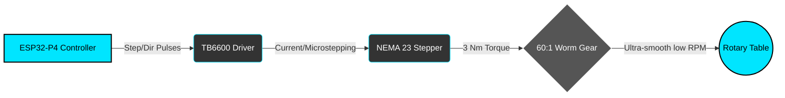
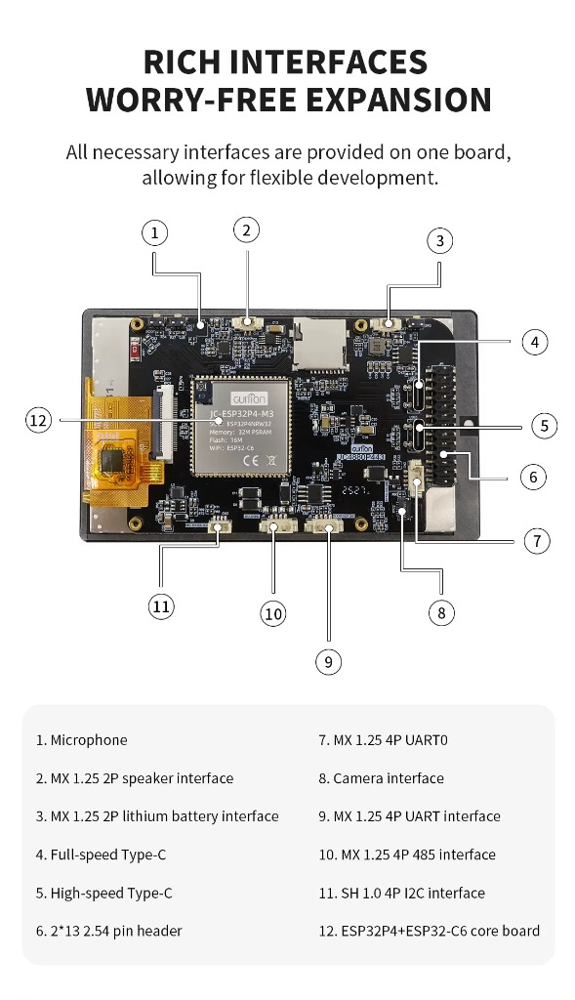

<div align="center">

# 🔧 DIY Welding Positioner Controller (ESP32-P4)
**Precision Multi-Mode Welding Rotator for TIG, MIG, and Pipe Welding**


**Open-source ESP32-P4 based welding positioner controller designed for rotary welding tables, pipe welding rotators, and automated fabrication systems.**

[](https://opensource.org/licenses/MIT)
[](https://platformio.org/)
[](https://docs.espressif.com/)
[](https://lvgl.io/)

</div>

---

## 🔎 What Is This Project?

This project is a **DIY welding positioner controller** built using the powerful **ESP32-P4 microcontroller**.

It is designed to control:
- Rotary welding tables  
- Welding turntables  
- Pipe welding rotators  
- Fabrication positioning systems  
- Automated TIG and MIG welding rigs  

The system drives a **NEMA 23 stepper motor** using a **TB6600 stepper driver**, combined with a **60:1 worm gear** for ultra-smooth low-RPM welding rotation.

This makes it ideal for:
- Pipe welding  
- Tube welding  
- Circular weld seams  
- Rotary welding automation  
- DIY industrial welding setups  

---

## ✨ Features

- **Pioneering Hardware:** Runs on the cutting-edge dual-core RISC-V **ESP32-P4** (400 MHz).
- **Stunning UI:** Completely overhauled flat, high-contrast dark theme built with true **LVGL 8.x**. Features neon cyan glowing active states and a large, readable central RPM meter.
- **Precision Motor Control:** Drives a NEMA 23 stepper via a TB6600 driver (0.1–5.0 RPM range) linked to a 60:1 worm gear reduction for ultra-smooth, high-torque rotation.
- **Industrial Safety:** Hardware E-STOP interrupt (NC contact), software watchdog timer, and fail-safe active-low motor enabling.
- **Multiple Welding Modes:** Continuous, Jog, Pulse, Step, Timer, and Programmable sequences.

---

## 🛠 Typical Use Cases

This welding positioner controller can be used for:

- TIG welding positioners  
- MIG welding automation  
- Pipe welding rotators  
- Tube welding fixtures  
- Rotary welding tables  
- Welding turntables  
- Robotics positioning systems  
- DIY industrial automation  

It is especially useful when precise, repeatable rotation is required during welding operations.

---

## 🧠 System Overview



The system components work in sequence to ensure flawless, non-backdrivable rotation:
- **ESP32-P4 Controller** → Generates precision hardware step pulses.
- **TB6600 Driver** → Provides exact microstepping current.
- **NEMA 23 Stepper Motor** → Delivers rotational torque.
- **60:1 Worm Gear** → Drastically reduces speed, multiplies torque, and locks the table in place.
- **Rotary Welding Table** → Holds the workpiece securely for TIG/MIG automation.

---

## 🖥️ Controller Board

The system is designed for the **Waveshare / Guition ESP32-P4 4.3" Touch Display Dev Board**.

<p align="center">
  
  
</p>

### Hardware Specs
- **MCU:** ESP32-P4 (Dual-core RISC-V 400 MHz) + ESP32-C6 (Wi-Fi 6 / BLE 5)
- **Memory:** 32 MB PSRAM, 16 MB Flash
- **Display:** 4.3" IPS 800×480 MIPI-DSI (ST7701S Controller)
- **Touch:** Capacitive 5-point touch (GT911 Controller via I2C on GPIO 7/8)

### Motor System

<p align="center">
  
</p>

- **Motor:** NEMA 23 stepper motor (High torque, 3 Nm output).
- **Driver:** TB6600 microstep driver (Set to 8 microsteps for high precision).
- **Gearbox:** 60:1 Worm Gear reduction. This ensures the workpiece cannot back-drive the motor and provides ultra-smooth, low-RPM rotation.

---

## 🔌 Wiring & Pinout

Wire your Stepper Motor Driver (e.g., TB6600), Potentiometer, and E-STOP button directly to the 2×13 GPIO header on the back of the board.

<div align="center">
  
</div>

| Function | GPIO | Notes |
|----------|------|-------|
| **Potentiometer** | `GPIO 49` | ADC speed control input |
| **Step (PUL)** | `GPIO 50` | RMT hardware pulse output |
| **Direction (DIR)** | `GPIO 51` | CW = HIGH, CCW = LOW |
| **Enable (ENA)** | `GPIO 52` | Active LOW to enable motor |
| **E-STOP** | `GPIO 33` | NC contact, triggers active LOW halt |

*(Note: Touch screen I2C is wired internally to GPIO 7/8. Backlight is on GPIO 26).*

---

## 🚀 Building & Flashing

Since there is currently no official ESP-IDF / Arduino core release for the ESP32-P4 in PlatformIO, this project relies on the community-maintained `pioarduino` fork.

### Prerequisites
- [PlatformIO](https://platformio.org/) installed (VS Code extension recommended).
- A USB-C data cable connected to the lower Type-C port (marked "ESP" / "UART").

### Flash Instructions

1. Clone this repository.
2. Open in VS Code with PlatformIO.
3. The necessary ESP-IDF components (`esp_lcd_st7701`, `esp_lcd_touch_gt911`) are already bundled cleanly in the `/lib` folder.
4. Run the following commands:

```bash
# 1. Compile the firmware
pio run -e esp32p4-touch-43

# 2. Upload to the board
pio run -t upload -e esp32p4-touch-43

# 3. Monitor serial output logs
pio device monitor -b 115200
```

---

## 📝 Menu Functions & Welding Modes

The UI presents several distinct welding modes designed to handle different types of pipe fabrication jobs.

| Mode | Description |
|------|-------------|
| **Continuous** | The standard operating mode. Starts spinning continuously at the set RPM when you press "ON", and stops when you hit "STOP". The RPM can be accurately nudged up or down using the `[ + ]` and `[ - ]` buttons right under the gauge while it is running. |
| **Jog** | A manual override mode for positioning the piece. You simply press and hold the "JOG" button on the screen. The motor spins as long as your finger is touching the screen, and stops instantly the millisecond you lift it. Perfect for perfectly aligning your weld start point. |
| **Pulse** | Specialized for tack-welding or segmented passes. The positioner will rotate a highly specific distance (e.g., 5 degrees), pause for a set amount of time so you can fuse the tack, and then automatically rotate another 5 degrees. |
| **Step** | A strictly measured rotation. Input exactly how many degrees you want to rotate (e.g., 90° for a quarter-turn), and the positioner will execute exactly that movement and wait. |
| **Timer** | Rotate at a set speed for an exact duration (e.g., 30 seconds). Excellent for creating perfectly timed, uniform cover passes on repetitive pipe sizes. |
| **Programs** | The memory bank. Allows you to save your favorite RPM speeds, pulse timings, and step degrees into custom slots (like "2-inch Tube" or "6-inch Schedule 40") so you don't have to dial in the settings perfectly every single time. |

---

## 🛡️ Safety Architecture

- **E-STOP First:** The E-STOP uses an external hardware interrupt. Breaking the NC circuit instantly sets the motor speed and acceleration to 0 and cuts the enable pin.
- **Fail-safe Start:** The motor always boots into a disabled (`STATE_IDLE`) state. It requires explicit user intent via the touch UI to start rotation.
- **Watchdog:** Inherits the ESP32 hardware watchdog to prevent software deadlocks.

---

## 🔮 Future Roadmap

- [ ] Wi-Fi / Web panel integration using the ESP32-C6 co-processor.
- [ ] Over-The-Air (OTA) firmware updates.
- [ ] Export/Import welding programs to an SD Card.
- [ ] Support for external Bluetooth foot pedals.

---

## 🔎 Keywords

DIY welding positioner  
ESP32 welding controller  
Rotary welding table  
Welding rotator controller  
Pipe welding turntable  
TB6600 stepper driver  
NEMA 23 welding motor  
Welding automation controller  
Industrial DIY welding  
ESP32-P4 LVGL controller  

---

<div align="center">
  <em>Built with ❤️ for precision fabricators.</em>
</div>
