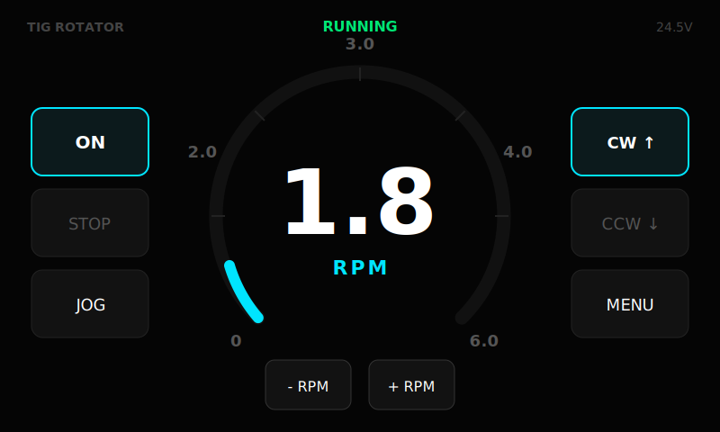
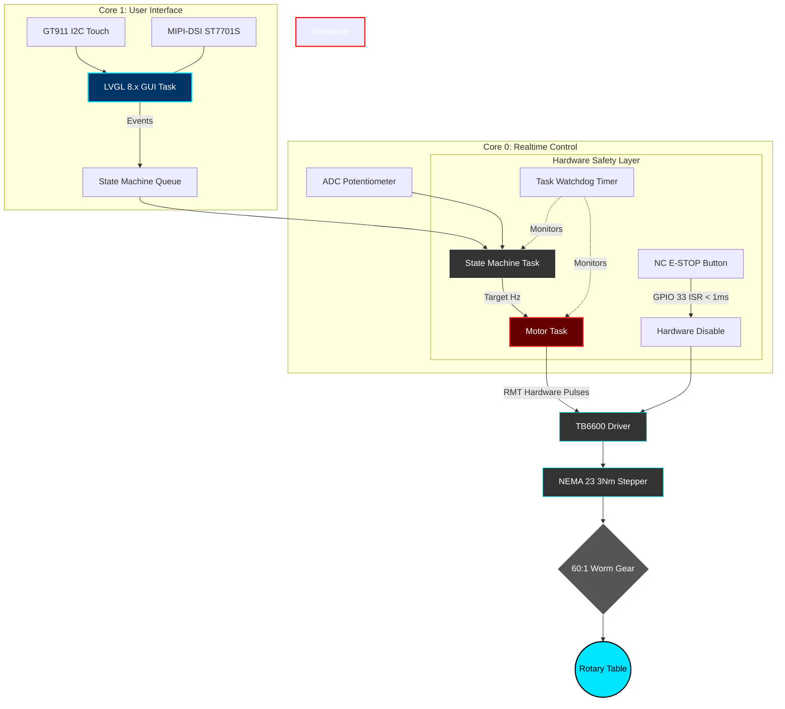
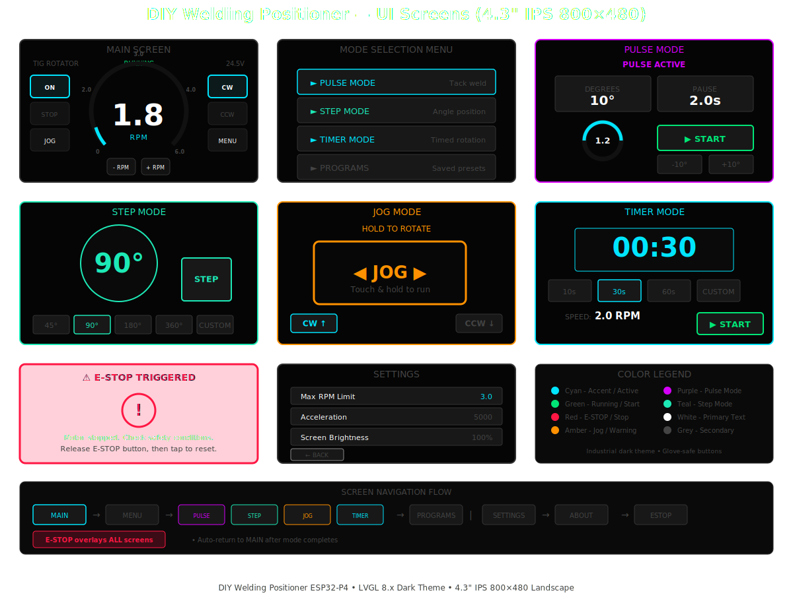
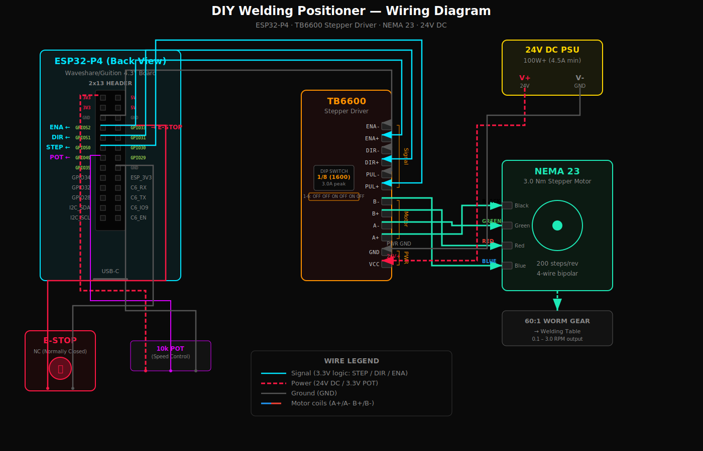

<div align="center">

# 🔧 DIY Welding Positioner Controller (ESP32-P4)
**Precision Multi-Mode Welding Rotator for TIG, MIG, and Pipe Welding**

**Firmware Version:** v0.3.0-beta
*(See Git tags for release history)*



**Open-source ESP32-P4 based welding positioner controller designed for rotary welding tables, pipe welding rotators, and automated fabrication systems.**

[](#)
[](https://opensource.org/licenses/MIT)
[](https://espressif.com/)
[](https://docs.espressif.com/)
[](https://lvgl.io/)
[](https://platformio.org/)

</div>

---

## ⚡ Quick Start

1. **Clone the repository:**

```bash
git clone https://github.com/catorendal-a11y/DIY-Welding-Positioner-ESP32-P4.git
cd DIY-Welding-Positioner-ESP32-P4
```

2. **Open in VS Code** with the **PlatformIO** extension installed.
3. **Select board environment:** `esp32p4-release` (Waveshare ESP32-P4 4.3")
4. **Build and flash:** Click the PlatformIO "Upload" button (➔), or run:

```bash
pio run -t upload
```

*(Since `default_envs` is configured, adding `-e esp32p4-release` is optional).*

**Optional debug build:**

```bash
pio run -t upload -e esp32p4-debug
```

*This enables verbose logging and debug diagnostics.*

5. **Connect hardware:** Wire your TB6600 driver, NEMA 23 stepper motor, and external power supply.

---

## 🎥 Demo

Watch the system in action: **UI interaction, Motor rotation, and Simulated welding passes.**  
*(Demo video link coming soon - Insert YouTube link here)*

---

## 🔎 What Is This Project?

This project is a **DIY welding positioner controller** built using the powerful **ESP32-P4 microcontroller**. It is designed to control rotary welding tables, welding turntables, pipe welding rotators, and automated fabrication systems. 

Driven by a NEMA 23 stepper motor and a 60:1 worm gear, it ensures ultra-smooth low-RPM rotation ideal for circular weld seams and continuous TIG/MIG passes.

### 🎯 Project Goals
- Build a reliable, industrial-grade DIY welding positioner.
- Provide accessible open-source firmware.
- Create a beautiful, glove-safe industrial user interface.
- Enable massive customization for different fabrication setups.

---

## 🧠 Industrial RTOS Architecture

This project is built on a professional dual-core **FreeRTOS** architecture, separating critical realtime motor control from the heavy graphics processing.



### Core Design Principles
1. **Task Isolation:** UI rendering (Core 1) cannot block motor pulses (Core 0).
2. **Hardware Timers:** Motor steps are generated using the ESP32 RMT peripheral, ensuring jitter-free micro-stepping regardless of CPU load.
3. **Fail-Safe Safety:** The Emergency Stop is tied directly to a zero-latency hardware interrupt (ISR) that cuts the driver's enable pin in <0.5ms. A 2.0-second hardware watchdog (TWDT) monitors the control tasks.
4. **Acceleration Ramps:** Linear S-curve acceleration via `FastAccelStepper` prevents motor stalls and jerky weld starts.

---

## 📸 Real Hardware

<p align="center">
  
  
</p>

---

## ✨ Features

- **Multi-mode rotation:** Continuous, Jog, Pulse, Step, and Timer modes.
- **Speed control:** Precise on-the-fly RPM adjustment.
- **LVGL touch interface:** Glove-safe, high-contrast industrial dark UI.
- **Hardware safety:** Dedicated NC E-STOP interrupt and software watchdog.
- **Smooth motion:** FastAccelStepper utilizing RMT hardware pulses for micro-stepping control.
- **Program Presets:** Save and load custom welding parameters to onboard LittleFS flash memory.

### 🖥️ All UI Screens

<div align="center">
  
</div>

---

## 📊 Performance Specifications

| Parameter | Value |
|-----------|-------|
| **Output RPM Range** | 0.1 – 3.0 RPM (safe default; up to 5.0 in clean environments) |
| **Gear Ratio** | 60:1 Worm Gear |
| **Microstepping** | 8x (Adjustable on driver) |
| **Motor Torque** | 3.0 Nm (NEMA 23) |
| **Control Resolution**| 0.01 RPM |
| **Max Table Load** | Depends on bearing & frame design |

---

## 🧩 Requirements

- **PlatformIO:** Core 6.x or newer
- **ESP-IDF:** v5.2+ (via pioarduino core, pinned release)
- **LVGL:** 8.x
- **FastAccelStepper:** ^0.31.3 (pinned)
- **Display:** ESP-IDF native MIPI-DSI panel driver (ST7701S-class). **Not LovyanGFX.**

### Hardware Check
- Waveshare / Guition ESP32-P4 4.3" Touch Display
- TB6600 stepper driver
- NEMA 23 motor
- 24–36V power supply

---

## 🧰 Bill of Materials (BOM)

| Component | Model / Specs | Qty |
|-----------|---------------|-----|
| **MCU Board** | Waveshare ESP32-P4 4.3" Display | 1 |
| **Stepper Driver** | TB6600 (Set to 8 microsteps) | 1 |
| **Stepper Motor** | NEMA 23 (3 Nm torque) | 1 |
| **Gearbox** | RV30 60:1 Worm Gear Reducer | 1 |
| **Power Supply** | 24V DC, ≥5A recommended for NEMA 23 (3Nm) | 1 |
| **Controls** | 10k Potentiometer (Speed) & NC E-STOP Button | 1 |

---

## 🎯 Target Hardware (Designed & Configured For)

This firmware is designed and configured for the following hardware.
Full validation is currently in progress.

- Waveshare ESP32-P4 4.3" Touch Display
- TB6600 Stepper Driver
- NEMA 23 (3 Nm torque)
- RV30 Worm Gear Reducer (60:1)
- 24V / 5A DC Power Supply
- 10k Potentiometer
- NC Emergency Stop Button

---

## 🔧 Supported Drivers

- **TB6600** (Current standard configuration)
- **DM542** (Planned / Drop-in replacement)
- **TMC5160** (Future ultra-silent integration)

---

## 🔌 Wiring Diagram

<div align="center">
  
</div>

> **See also:** [Detailed Hardware Setup Guide](docs/HARDWARE_SETUP.md) · [EMI Mitigation Guide](docs/EMI_MITIGATION.md) · [Safety System](docs/SAFETY_SYSTEM.md)

---

## 📂 Project Directory Structure

```text
DIY-Welding-Positioner-ESP32-P4/
├── src/
│   ├── main.cpp
│   ├── motor/          # FastAccelStepper logic & RMT pulses
│   ├── control/        # Welding modes (continuous, jog, pulse, step, timer)
│   ├── safety/         # E-STOP interrupt & hardware watchdog
│   ├── ui/             # LVGL 8.x dashboards & themes
│   └── config.h        # Pinouts & physical gear ratios
├── test/               # Logic verification & simulation suites
├── docs/
│   └── images/         # Wiring diagrams & UI mockups
├── platformio.ini      # Build environment for ESP32-P4
└── README.md           # This master documentation
```

---

## 📍 Pinout

<div align="center">
  
</div>

| ESP32 Pin | Function | Notes |
|-----------|----------|-------|
| GPIO 50 | **STEP (Output)** | Step pulse output |
| GPIO 51 | **DIR (Output)** | Direction control (CW/CCW) |
| GPIO 52 | **ENABLE (Output)** | Active LOW to enable motor |
| GPIO 49 | **ADC (Input)** | Potentiometer speed control (verify ADC capability on your board revision) |
| GPIO 33 | **E-STOP (Input, Interrupt)** | NC Contact (Active LOW halt) |

*(Note: Touch screen I2C is wired internally to GPIO 7/8. Display MIPI-DSI uses dedicated lanes).*

---

## ⚙️ Configuration

Key physical parameters can be adjusted right at the top of the header files to perfectly match your specific mechanical build. 

Open `src/config.h` to tweak:

```cpp
#define MOTOR_MICROSTEPS 8      // Must match dip-switches on your TB6600
#define MOTOR_GEAR_RATIO 60     // e.g., 60:1 Worm Gear
#define MAX_RPM 3.0             // Upper limit of the UI gauge
#define ACCELERATION 5000       // Stepper acceleration (steps/s²)
```

---

## 📝 Welding Modes

| Mode | Description |
|------|-------------|
| **Continuous** | Standard rotation. Starts spinning continuously at the set RPM when you press "ON", and stops when you hit "STOP". |
| **Jog** | Manual override. The motor spins only as long as your finger is touching the screen icon. Perfect for aligning start points. |
| **Pulse** | Specialized for tack-welding. Rotates a specific distance, pauses for the tack to fuse, and automatically rotates again. |
| **Step** | Rotates an exact degree amount (e.g., 90° for a quarter-turn) and stops. |
| **Timer** | Rotates at a set speed for an exact duration (e.g., 30 seconds). |

---

## 🧪 First Bench Test Checklist

Before connecting mechanical load:

- [ ] Display boots successfully
- [ ] Touch input responds correctly
- [ ] Motor rotates at 0.3 RPM
- [ ] E-STOP halts motion immediately
- [ ] No watchdog resets observed

---

## ⚠️ Safety Notice

- **E-STOP:** The E-STOP uses an external hardware interrupt. Breaking the NC circuit instantly sets the motor speed and acceleration to 0 and cuts the enable pin.
- **Power Sequencing:** Never power the motor without the TB6600 driver properly connected to the coils.
- **Motor Coils (CRITICAL):** Never connect or disconnect motor coils while the stepper driver is powered. This will destroy the driver.
- **Voltage Verification:** Always verify your 24V-36V power supply output before connecting it to the system.
- **Testing:** Always test new configurations with low motor current settings first to prevent mechanical damage.

---

## 🛠️ Troubleshooting

### Motor does not move
- Check STEP/DIR wiring continuity.
- Verify ENABLE pin logic (try tying it directly to LOW/GND if motor lacks holding torque).
- Confirm driver power supply is active and outputs 24V–36V at ≥5A.

### Wrong rotation direction
- Swap the DIR pin polarity in firmware, OR physically reverse one motor coil wiring pair (A+ and A-).

### No display on boot
- Verify ESP32-P4 drivers installed correctly via ESP-IDF.
- If flashing from VS Code, ensure you are not missing the PSRAM init settings in platformio.ini.

---

## ⚠️ Known Limitations

- Single-axis control only.
- Requires manual configuration of your specific gear ratio in `config.h`.
- Encoder feedback loop (Closed-Loop) is planned but not currently implemented.
- Not tested with external servo motors (pure step/dir steppers only).

---

## 🛣️ Roadmap

- [x] Basic rotation and UI setup
- [x] Speed control and Acceleration
- [x] Pulse and Step modes
- [x] Program Preset Storage (LittleFS + ArduinoJson)
- [ ] Wi-Fi / Web panel remote control (ESP32-C6)
- [ ] OTA firmware updates

---

## 📄 License

This project is licensed under the MIT License.
See the LICENSE file in the root directory for more details.

---

## 🔎 Keywords

DIY welding positioner, ESP32 welding controller, Rotary welding table, Welding rotator controller, Pipe welding turntable, TB6600 stepper driver, NEMA 23 welding motor, Welding automation controller, Industrial DIY welding, ESP32-P4 LVGL controller
