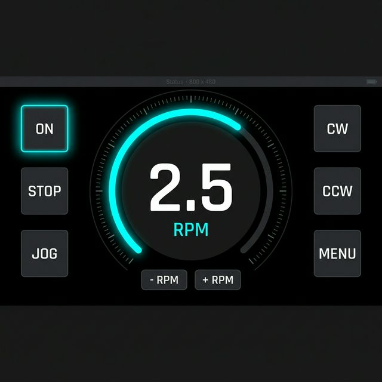

<div align="center">

# 🔧 DIY Welding Positioner ESP
**Precision Multi-Mode Rotator Controller for TIG Pipe Welding**



*Built on the ESP32-P4 with a 4.3" MIPI-DSI ST7701S touch display, featuring a modern, glove-safe industrial dark UI.*

</div>

---

## ✨ Features

- **Pioneering Hardware:** Runs on the cutting-edge dual-core RISC-V **ESP32-P4** (400 MHz).
- **Stunning UI:** Completely overhauled flat, high-contrast dark theme built with true **LVGL 8.x**. Features neon cyan glowing active states and a large, readable central RPM meter.
- **Precision Motor Control:** Drives a NEMA 23 stepper via a TB6600 driver (0.1–5.0 RPM range) linked to a 60:1 worm gear reduction for ultra-smooth, high-torque rotation.
- **Industrial Safety:** Hardware E-STOP interrupt (NC contact), software watchdog timer, and fail-safe active-low motor enabling.
- **Multiple Welding Modes:** Continuous, Jog, Pulse, Step, Timer, and Programmable sequences.

---

## 🖥️ Controller Board

The system is designed for the **Waveshare / Guition ESP32-P4 4.3" Touch Display Dev Board**.

<p align="center">
  
  
</p>

### Hardware Specs
- **MCU:** ESP32-P4 (Dual-core RISC-V 400 MHz) + ESP32-C6 (Wi-Fi 6 / BLE 5)
- **Memory:** 32 MB PSRAM, 16 MB Flash
- **Display:** 4.3" IPS 800×480 MIPI-DSI (ST7701S Controller)
- **Touch:** Capacitive 5-point touch (GT911 Controller via I2C on GPIO 7/8)

---

## 🔌 Wiring & Pinout

Wire your Stepper Motor Driver (e.g., TB6600), Potentiometer, and E-STOP button directly to the 2×13 GPIO header on the back of the board.

<div align="center">
  
</div>

| Function | GPIO | Notes |
|----------|------|-------|
| **Potentiometer** | `GPIO 49` | ADC speed control input |
| **Step (PUL)** | `GPIO 50` | RMT hardware pulse output |
| **Direction (DIR)** | `GPIO 51` | CW = HIGH, CCW = LOW |
| **Enable (ENA)** | `GPIO 52` | Active LOW to enable motor |
| **E-STOP** | `GPIO 33` | NC contact, triggers active LOW halt |

*(Note: Touch screen I2C is wired internally to GPIO 7/8. Backlight is on GPIO 26).*

---

## 🚀 Building & Flashing

Since there is currently no official ESP-IDF / Arduino core release for the ESP32-P4 in PlatformIO, this project relies on the community-maintained `pioarduino` fork.

### Prerequisites
- [PlatformIO](https://platformio.org/) installed (VS Code extension recommended).
- A USB-C data cable connected to the lower Type-C port (marked "ESP" / "UART").

### Flash Instructions

1. Clone this repository.
2. Open in VS Code with PlatformIO.
3. The necessary ESP-IDF components (`esp_lcd_st7701`, `esp_lcd_touch_gt911`) are already bundled cleanly in the `/lib` folder.
4. Run the following commands:

```bash
# 1. Compile the firmware
pio run -e esp32p4-touch-43

# 2. Upload to the board
pio run -t upload -e esp32p4-touch-43

# 3. Monitor serial output logs
pio device monitor -b 115200
```

---

## 📝 Modus Operandi

| Mode | Description |
|------|-------------|
| **Continuous** | Constant speed rotation, adjustable dynamically via UI +/- buttons or ADC pot. |
| **Jog** | Press-and-hold for manual positioning. Starts immediately upon press. |
| **Pulse** | Fixed angle increments followed by pauses (e.g., for tack spacing). |
| **Step** | Single-step mode for highly precise workpiece alignment. |
| **Timer** | Rotate for a set exact duration, then auto-stop. |

---

## 🛡️ Safety Architecture

- **E-STOP First:** The E-STOP uses an external hardware interrupt. Breaking the NC circuit instantly sets the motor speed and acceleration to 0 and cuts the enable pin.
- **Fail-safe Start:** The motor always boots into a disabled (`STATE_IDLE`) state. It requires explicit user intent via the touch UI to start rotation.
- **Watchdog:** Inherits the ESP32 hardware watchdog to prevent software deadlocks.

---

<div align="center">
  <em>Built with ❤️ for precision fabricators.</em>
</div>
