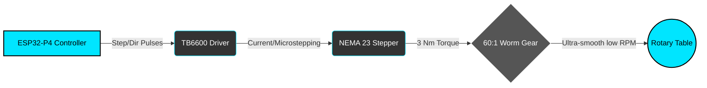

<div align="center">

# 🔧 DIY Welding Positioner Controller (ESP32-P4)
**Precision Multi-Mode Welding Rotator for TIG, MIG, and Pipe Welding**


**Open-source ESP32-P4 based welding positioner controller designed for rotary welding tables, pipe welding rotators, and automated fabrication systems.**

[](https://opensource.org/licenses/MIT)
[](https://espressif.com/)
[](https://docs.espressif.com/)
[](https://lvgl.io/)
[](https://platformio.org/)

</div>

---

## ⚡ Quick Start

1. **Clone repository**
```bash
git clone https://github.com/catorendal-a11y/DIY-Welding-Positioner-ESP32-P4.git
cd DIY-Welding-Positioner-ESP32-P4
```
2. **Open in VS Code** with the PlatformIO extension installed.
3. **Select board environment:** `esp32p4-touch-43`
4. **Build and flash:**
   Click the PlatformIO "Upload" button (➔), or run:
```bash
pio run -t upload -e esp32p4-touch-43
```
5. **Connect:** Wire the TB6600 driver, NEMA 23 stepper motor, and power supply according to the pinout.

---

## 🎥 Demo

Watch the system in action (UI walkthrough and motor rotation):  
*(Demo video link coming soon - Insert YouTube link here)*

---

## 🔎 What Is This Project?

This project is a **DIY welding positioner controller** built using the powerful **ESP32-P4 microcontroller**. It is designed to control Rotary welding tables, Welding turntables, Pipe welding rotators, and Automated fabrication systems. 

Driven by a NEMA 23 stepper motor and a 60:1 worm gear, it ensures ultra-smooth low-RPM rotation ideal for circular weld seams and continuous TIG/MIG passes.

---

## 📸 Real Hardware

<p align="center">
  
  
</p>

---

## ✨ Features

- **Multi-mode rotation:** Continuous, Jog, Pulse, Step, and Timer modes.
- **Speed control:** Precise on-the-fly RPM adjustment.
- **LVGL touch interface:** Glove-safe, high-contrast industrial dark UI.
- **Hardware safety:** Dedicated E-STOP interrupt and software watchdog.
- **Smooth motion:** Utilizing RMT hardware pulses for micro-stepping control.

---

## 🧰 Bill of Materials (BOM)

| Component | Model / Specs | Qty |
|-----------|---------------|-----|
| **MCU Board** | Waveshare ESP32-P4 4.3" Touch Display | 1 |
| **Stepper Driver** | TB6600 (Set to 8 microsteps) | 1 |
| **Stepper Motor** | NEMA 23 (3 Nm torque) | 1 |
| **Gearbox** | RV30 60:1 Worm Gear Reducer | 1 |
| **Power Supply** | 24V DC (For stepper driver) | 1 |
| **Controls** | 10k Potentiometer (Speed) & NC E-STOP Button | 1 |

---

## 🧠 System Overview



### 🏗️ Project Architecture

```text
ESP32-P4 Firmware
 ├── UI (LVGL 8.x)
 │     ├── Main Dashboard (RPM Gauge, Controls)
 │     ├── Settings Menus
 │     └── Theme System (Dark/Cyan)
 ├── Motion Control (FastAccelStepper)
 │     ├── Step Pulse Generation (RMT)
 │     ├── Acceleration/Deceleration
 │     └── Real-time RPM calculations
 ├── Input Handling
 │     ├── Analog Potentiometer (ADC)
 │     └── E-STOP external interrupt
 └── State Machine
       ├── Continuous / Jog / Pulse / Step Modes
       └── Safety Halt State
```

---

## 📍 Pinout & Wiring

<div align="center">
  
</div>

| ESP32 Pin | Function | Notes |
|-----------|----------|-------|
| `GPIO 50` | **STEP (PUL)** | Step pulse output |
| `GPIO 51` | **DIR** | Direction control (CW/CCW) |
| `GPIO 52` | **ENABLE** | Active LOW to enable motor |
| `GPIO 49` | **Analog Input** | Potentiometer speed control |
| `GPIO 33` | **E-STOP** | NC Contact (Active LOW halt) |

*(Note: Touch screen I2C is wired internally to GPIO 7/8. Display MIPI-DSI uses dedicated lanes).*

---

## ⚠️ Safety Notice

- **E-STOP:** The E-STOP uses an external hardware interrupt. Breaking the NC circuit instantly sets the motor speed and acceleration to 0 and cuts the enable pin.
- **Power Sequencing:** Never power the motor without the TB6600 driver properly connected to the coils.
- **Voltage Verification:** Always verify your 24V-36V power supply output before connecting it to the system.
- **Testing:** Always test new configurations with low motor current settings first to prevent mechanical damage.

---

## 📝 Welding Modes

| Mode | Description |
|------|-------------|
| **Continuous** | Standard rotation. Starts spinning continuously at the set RPM when you press "ON", and stops when you hit "STOP". |
| **Jog** | Manual override. The motor spins only as long as your finger is touching the screen icon. Perfect for aligning start points. |
| **Pulse** | Specialized for tack-welding. Rotates a specific distance, pauses for the tack to fuse, and automatically rotates again. |
| **Step** | Rotates an exact degree amount (e.g., 90° for a quarter-turn) and stops. |
| **Timer** | Rotates at a set speed for an exact duration (e.g., 30 seconds). |

---

## 🛣️ Roadmap

- [x] Basic rotation and UI setup
- [x] Speed control and Acceleration
- [x] Pulse and Step modes
- [ ] Welding HF sync mode integration
- [ ] Wi-Fi / Web panel remote control (ESP32-C6)
- [ ] Preset storage to memory
- [ ] OTA firmware updates

---

## 🔎 Keywords

DIY welding positioner, ESP32 welding controller, Rotary welding table, Welding rotator controller, Pipe welding turntable, TB6600 stepper driver, NEMA 23 welding motor, Welding automation controller, Industrial DIY welding, ESP32-P4 LVGL controller
