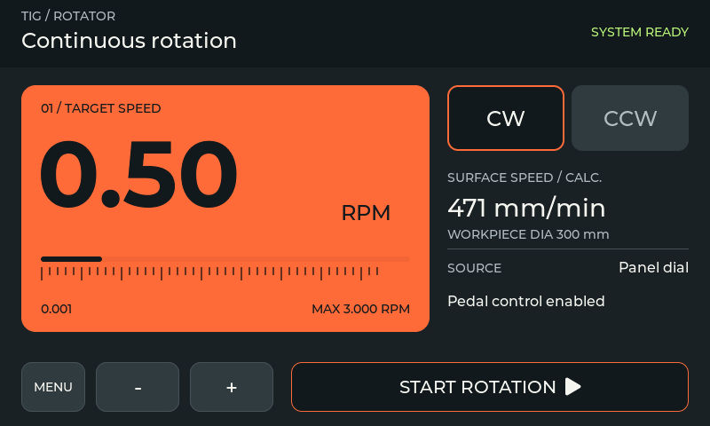
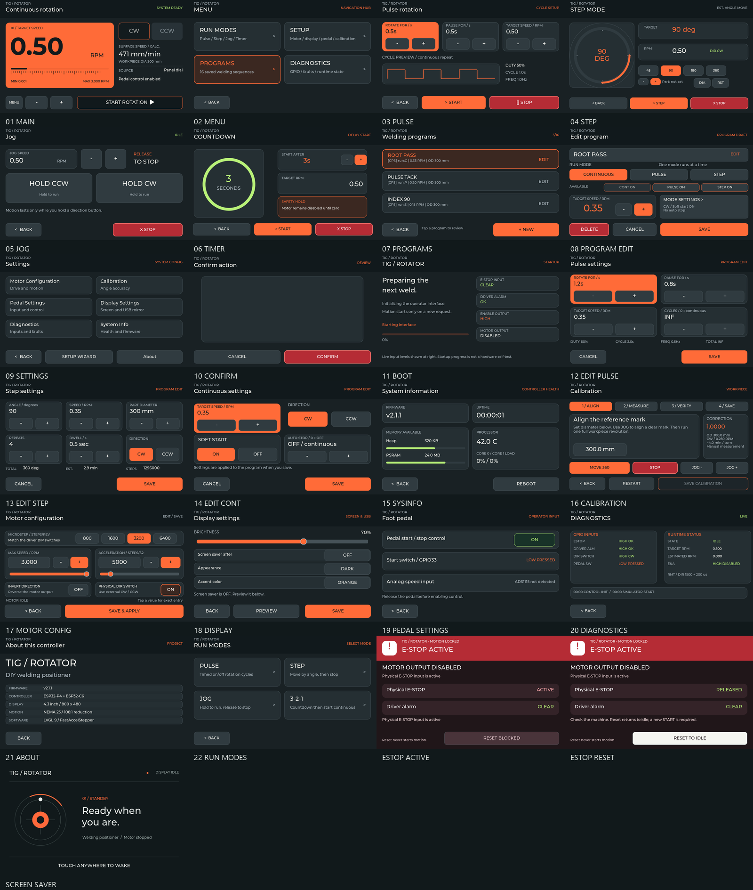
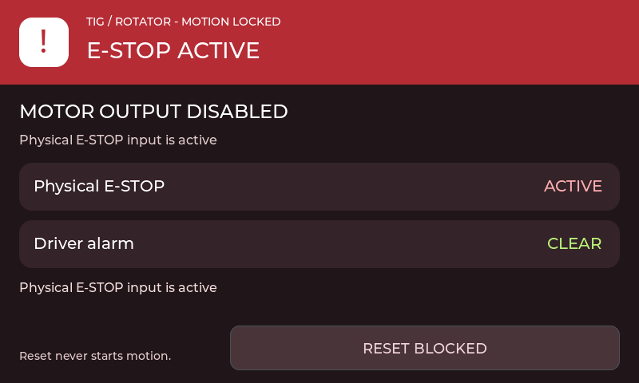
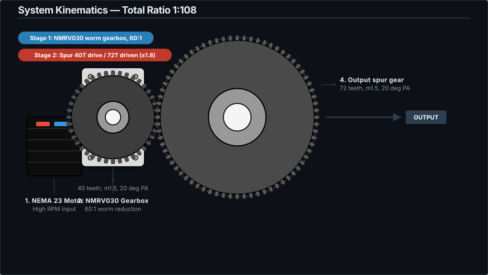
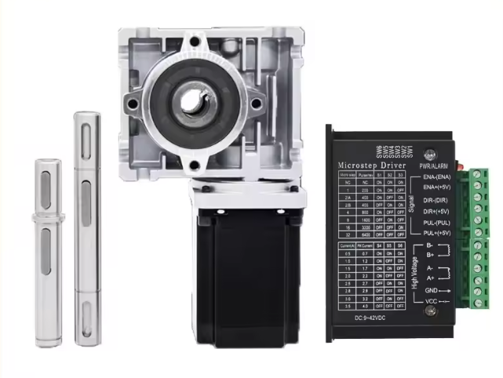
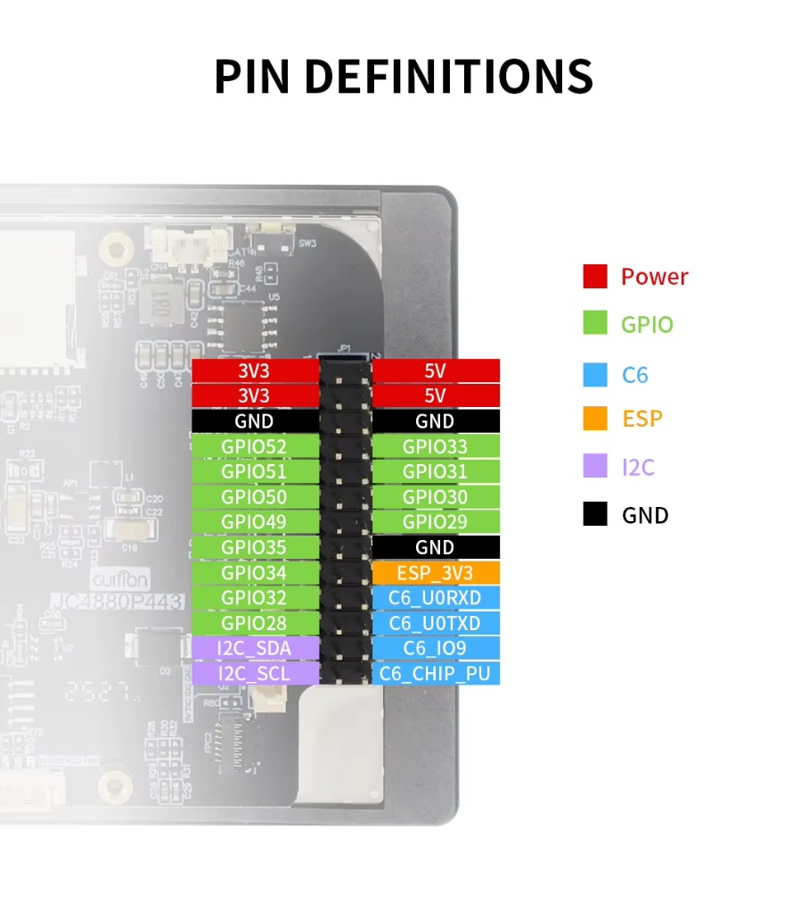
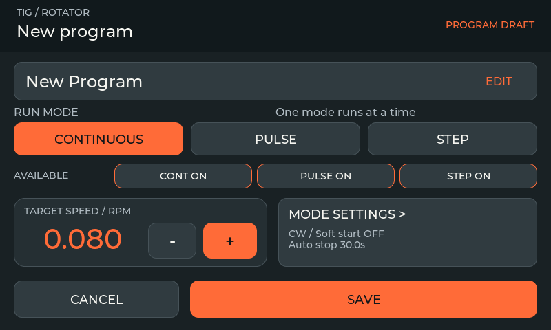
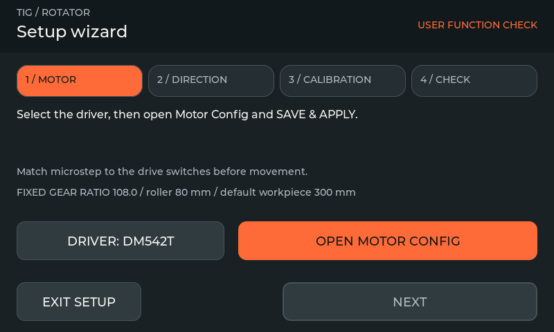
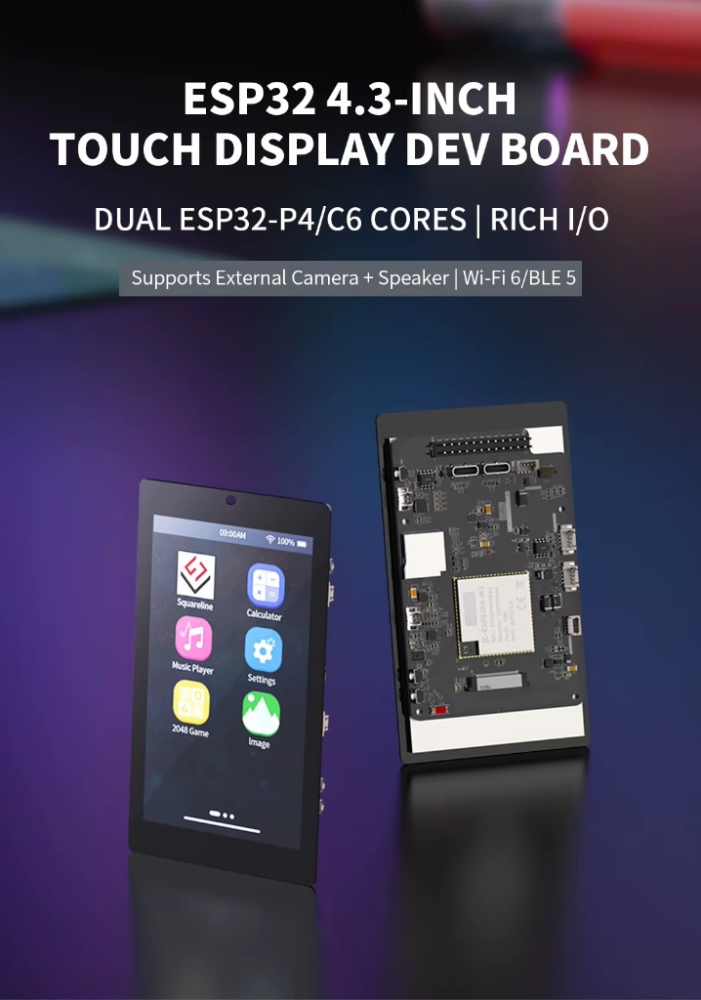
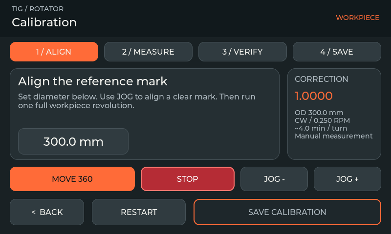

# Complete Builder Reference

Detailed material retained from the former README. Start with the [short project overview](../README.md); use this guide for full hardware, configuration, troubleshooting, storage and architecture reference. Historical photos, SVG proposals and deployment results are identified separately from current runtime behavior.

<div align="center">

# DIY Welding Positioner Controller

### Precision Multi-Mode Welding Rotator for TIG, MIG, and Pipe Welding

**ESP32-P4 &nbsp;&middot;&nbsp; Source firmware v2.1.1**

[](https://github.com/catorendal-a11y/DIY-Welding-Positioner-ESP32-P4/actions/workflows/pio-build.yml)
[](https://github.com/catorendal-a11y/DIY-Welding-Positioner-ESP32-P4/releases/latest)
[](https://github.com/catorendal-a11y/DIY-Welding-Positioner-ESP32-P4/wiki)
[](../LICENSE)
[](../platformio.ini)

<sub>GUITION JC4880P443C 4.3" touch display board.</sub>

<br>





<sub>Actual LVGL simulator captures with example data. Hardware photos and demo below show the existing build.</sub>

<br>

Open-source controller for a stepper-driven welding positioner / pipe rotator, with a touch UI designed for workshop use, a dedicated motion executor, persistent presets, foot pedal support, and hardwired E-STOP behavior.

Builder docs: [GitHub Wiki](https://github.com/catorendal-a11y/DIY-Welding-Positioner-ESP32-P4/wiki) for getting started, hardware setup, troubleshooting, architecture, and roadmap.

<br>

[](#)
[](https://opensource.org/licenses/MIT)
[](https://espressif.com/)
[](https://docs.espressif.com/)
[](https://lvgl.io/)
[](https://platformio.org/)

<br>

*If this project helped you build something, consider giving it a star.*

</div>

<br>

---

## What changed

- Dark graphite/orange UI, larger text, rounded controls and a native 104 px bold numeric font.
- Large speed panel, CW/CCW selection, main-screen RPM +/− adjustment and a fixed wide START/STOP area. The physical direction switch retains priority when enabled.
- More visible red stop controls and a full-screen fault overlay with input state and guarded reset.
- STOP has a separate latch and invalidates pending starts. Start requests no longer overwrite stop requests.
- Pedal control requires stable release before arming. Stale/failed active pedal data blocks motion instead of silently selecting the panel potentiometer.
- Touch read errors release input; JOG requires regular UI renewal. Motion is blocked until critical tasks are ready.
- Program drafts survive navigation. Program parameters and motor configuration are applied through the control task.
- Failed NVS writes stay pending and retry; UI reports pending/failed saves. Five-minute dimming stores correctly.
- Pulse pause timing begins after the motor library reports stopped. USB mirror writes have bounded waits and release remote input on failure.

[Implementation details](../docs/IMPROVEMENTS_2026-10-01.md) · [V5 integration and upload record](../docs/UI_V5_DEPLOYMENT.md) · [Changelog](../CHANGELOG.md)

**Current release: v2.1.1, updated 3 October 2026.** V5 identifies the UI design iteration. [Download firmware and read the release notes](https://github.com/catorendal-a11y/DIY-Welding-Positioner-ESP32-P4/releases/tag/v2.1.1). The current firmware and simulator include LVGL 9.6, FastAccelStepper 1.4, guided setup/calibration and the revised program editor.

v2.1.1 adds bounded motor error handling, precise RPM values, durable calibration confirmation and production motion tests. This release is validated on the host and has not been flashed or physically tested as part of publication. [Maintenance implementation report](../docs/MAINTENANCE_2026-10-02.md) · [FastAccelStepper re-audit](../docs/FASTACCELSTEPPER_1_4_REAUDIT.md).

---

## Quick Navigation

| Start | Build | Hardware | Safety | Docs |
|:---|:---|:---|:---|:---|
| [Quick Start](#quick-start) | [Build Commands](#build-commands) | [Wiring](#wiring-diagram) | [TIG HF Requirement](#tig-hf-noise-requirement) | [Documentation Map](#documentation-map) |
| [Demo](#demo) | [Features](#features) | [Bill of Materials](#bill-of-materials) | [Troubleshooting](#troubleshooting) | [Project Structure](#project-structure) |
| [PC UI Simulator](#pc-ui-simulator) | [USB-C Live Mirror](#usb-c-live-mirror) | [First Bench Test](#first-bench-test-checklist) | [Safety Notice](#safety-notice) | [Simulator README](../simulator/README.md) |

---

## Quick Start

Fast path for builders who already have PlatformIO installed.

**Needed:** GUITION JC4880P443C ESP32-P4 board, PlatformIO, verified driver wiring, and a grounded metal enclosure for TIG HF welding. No LittleFS upload is needed; settings and presets use NVS.

1. **Clone the repository:**

   ```bash
   git clone https://github.com/catorendal-a11y/DIY-Welding-Positioner-ESP32-P4.git
   cd DIY-Welding-Positioner-ESP32-P4
   ```

2. **Build and flash** from VS Code / PlatformIO terminal:

   ```bash
   pio run --target upload
   ```

   Debug build with verbose serial logging:

   ```bash
   pio run --target upload -e esp32p4-debug
   ```

   Build output is written to `.pio/build-fw` to avoid Windows file-lock conflicts.

3. **Optional native tests** - pure logic, no hardware required:

   ```bash
   pio test -e native -e native-control
   ```

4. **Optional PC UI simulator** - test the LVGL interface without ESP32 hardware:

   ```powershell
   .\simulator\run.ps1
   .\simulator\run.ps1 -SelfTest
   .\simulator\run.ps1 -Screenshots artifacts\sim_screens
   ```

5. **Optional USB-C live mirror** - view and control the real ESP32 UI from Windows:

   ```powershell
   pio run -e esp32p4-mirror --target upload
   .\simulator\run.ps1 -UsbMirror COM5 -Baud 4000000
   ```

   On the device, open **Settings > Display > USB MIRROR** and arm it after the PC viewer shows a link. E-STOP and driver faults still override all UI input.

6. **Connect hardware** per the [wiring diagram](#wiring-diagram). Keep motor PSU off until logic power, E-STOP, ENA, STEP, DIR, and driver settings are verified.

7. **For TIG HF start welding:** put the ESP32-P4 screen, stepper driver, and motor PSU inside the same grounded metal enclosure before welding near the controller.

---

## At a Glance

Single-axis welding positioner firmware for a NEMA 23 / DM542T-style stepper rotator.

| Area | Current Implementation |
|:---|:---|
| Controller | GUITION JC4880P443C ESP32-P4 4.3" MIPI-DSI touch board |
| Motion | NEMA 23 stepper through PUL/DIR driver or DM542T |
| Drivetrain | NMRV030 60:1 worm stage plus 72/40 spur stage, total 1:108 |
| Speed | Main potentiometer, main-screen RPM +/−, optional ADS1115 pedal pot, saved presets |
| UI | LVGL 9, 800x480 landscape, V5 graphite/orange styling, PC simulator screenshots |
| Safety | GPIO34 HIGH healthy / LOW fault, DM542T ALM input, ENA HIGH disable assumption |
| Storage | NVS JSON settings + up to 16 presets |

The V5 main screen adds RPM +/− controls beside the panel potentiometer input. Speed adjustment and direction selection are blocked during motion. The physical direction switch retains priority when enabled. Jog has its own touch +/− controls for setup movement.

---

## Demo

Watch the system in action — UI interaction, motor rotation, screen navigation, E-STOP, direction switch, and pot control.

<div align="center">

[](https://youtu.be/GygLl6XY-TM)

</div>

---

## Features

| Area | What matters |
|:---|:---|
| **Welding workflow** | Continuous, Jog, Pulse, Step, and Countdown modes with panel-pot/main RPM +/− control and Jog +/− setup control |
| **Presets** | 16 NVS-backed jobs with RPM, direction, workpiece diameter, pulse cycles, step repeats/dwell, soft-start, and auto-stop fields |
| **Industrial inputs** | E-STOP, DM542T ALM, direction switch, foot pedal switch, optional ADS1115 pedal speed input |
| **Touch HMI** | LVGL 9, 800x480 landscape, V5 dark graphite/orange styling, dark/light mode, 8 accent colors, diagnostics, system info, motor config, calibration, display settings |
| **Motor control** | FastAccelStepper RMT pulses, milli-Hz RPM commands, acceleration tuning, microstepping, calibration, direction invert |
| **Safety model** | ISR disables ENA, state machine latches faults, start paths re-check E-STOP/ALM after ENA LOW, dimmed display wakes on fault |
| **Robustness** | Dual-core FreeRTOS split, mutex-protected stepper API, `std::atomic` cross-core flags, debounced NVS writes |

---

## Why This Project Is Different

Most DIY welding rotator projects stop at "turn a stepper at a set speed." This firmware is built around the parts that usually fail in a real TIG shop: HF noise, blocked starts, unsafe enable timing, touch UI reliability, and recoverable field diagnostics.

| Compared With | Typical Limitation | This Project |
|:---|:---|:---|
| Basic Arduino stepper sketch | Single loop, no UI state machine, limited fault handling | Dual-core FreeRTOS with separate input, control, safety, UI, and storage tasks |
| Generic CNC / GRBL controller | Optimized for G-code rather than a dedicated welding workflow | Purpose-built TIG rotator UI with Continuous, Jog, Pulse, Step, Timer, presets, and foot pedal support |
| Cheap speed-controller modules | Pot-only control, no saved jobs, weak diagnostics | NVS presets, workpiece diameter fields, diagnostics screen, event log, and display/system info |
| Open-bench ESP32 projects | Often unstable near HF-start TIG welding | Field-tested with TIG after moving ESP32-P4 screen, DM542T driver, and PSU into one grounded metal enclosure |
| Simple E-STOP input | Software polling or unsafe enable assumptions | GPIO34 ISR forces ENA HIGH, state machine latches fault, and motion-start paths re-check E-STOP/ALM after ENA LOW |
| Display demos | Pretty screen but no realtime motor isolation | LVGL runs on Core 1; motion tasks and RMT channel allocation use Core 0 |
| Fixed motor configs | Hardcoded microstep/speed assumptions | Touch-configurable microstepping, acceleration, direction invert, max RPM clamp, calibration, and storage validation |

The project combines dedicated welding modes, input diagnostics and documented enclosure experience from TIG HF testing. The latest software changes have native and simulator coverage; physical motor and safety checks for this update remain bench work.

---

## Operator Workflow

1. Power the ESP32-P4/controller logic first. The firmware boots with ENA disabled.
2. Verify the main screen appears, touch responds, and E-STOP is released.
3. Set driver current and microstep DIP switches to match **Settings > Motor Config**.
4. Turn on the motor supply after STEP/DIR/ENA and E-STOP wiring are checked.
5. Use the main potentiometer or the idle-screen **+ / −** controls to set workpiece RPM, then press **START** for continuous mode.
6. Use **JOG** for manual positioning, **PULSE** for tack cycles, **STEP** for indexed rotation, or **TIMER** for countdown start.
7. Use the E-STOP as the first response to unsafe motion. The red overlay only resets after the physical fault is cleared.

---

## UI Screens

The UI is built from **23 registered screen types** (including the Setup Wizard) plus a separate full-screen fault overlay. The table below maps the firmware registry.



Simulated active fault: the physical input must be cleared before reset is available. Reset returns to idle and requires a new START.

### Design reference

[V5 SVG proposals](../docs/images/ui_mockup_v5/all_screens.svg) · [Design bundle](../docs/images/ui_mockup_v5.zip) · [Readability review](../docs/images/ui_mockup_v5/READABILITY_REVIEW.md) · [Previous UI map](../docs/images/ui_screens.svg)

The 30 design views cover all 22 screen types, additional states and keyboards. The SVG audit measured 581 text elements at 800 × 480. Those results apply to the mockups; actual firmware captures are shown above. Calibration now uses a guided, non-scrolling workflow; step and countdown retain some existing controls and layouts; see the [integration notes](../docs/UI_V5_DEPLOYMENT.md).

<details>
<summary><b>ScreenId registry</b></summary>

| Screen | `ScreenId` | Description |
|:---|:---|:---|
| **Boot** | `SCREEN_BOOT` | Startup splash / transition to main |
| **Main** | `SCREEN_MAIN` | Large orange RPM panel, idle RPM +/−, CW/CCW and wide START/STOP |
| **Menu** | `SCREEN_MENU` | Advanced mode selection and settings |
| **Run Modes** | `SCREEN_RUN_MODES` | Pulse / Step / Jog / Timer selection |
| **Setup Wizard** | `SCREEN_SETUP` | Motor, direction, verified calibration and physical E-STOP function check (v2.1.1) |
| **Jog** | `SCREEN_JOG` | Touch-and-hold rotation for manual positioning (has its own RPM +/-) |
| **Pulse** | `SCREEN_PULSE` | ON/OFF cycle for tack welding |
| **Step** | `SCREEN_STEP` | Rotate exact angle, then stop |
| **Timer (Countdown)** | `SCREEN_TIMER` | Visual 3-2-1 countdown before continuous rotation starts (1-10 s configurable) |
| **Programs** | `SCREEN_PROGRAMS` | Preset list with save, load, delete |
| **Program Edit** | `SCREEN_PROGRAM_EDIT` | Fixed layout, separate run/available modes, exact RPM and full-screen name editor |
| **Edit Pulse** | `SCREEN_EDIT_PULSE` | Quick preset edit for pulse parameters |
| **Edit Step** | `SCREEN_EDIT_STEP` | Quick preset edit for step parameters |
| **Edit Continuous** | `SCREEN_EDIT_CONT` | Quick preset edit for continuous / RPM preset fields |
| **Settings** | `SCREEN_SETTINGS` | Hub for Motor Config, Calibration, Display, Pedal Settings, Diagnostics, System Info and About |
| **Display** | `SCREEN_DISPLAY` | Brightness, dim timeout, **UI MODE** (DARK/LIGHT), accent theme selection |
| **System Info** | `SCREEN_SYSINFO` | Core load, heap, PSRAM, uptime |
| **Calibration** | `SCREEN_CALIBRATION` | Guided Align → Measure → Verify → Save, with isolated draft correction |
| **Motor Config** | `SCREEN_MOTOR_CONFIG` | Microstepping, acceleration, direction switch, pedal enable |
| **Pedal Settings** | `SCREEN_PEDAL_SETTINGS` | Pedal arm/disarm plus live GPIO33 and ADS1115 status |
| **Diagnostics** | `SCREEN_DIAGNOSTICS` | Live GPIO/fault page for ESTOP, ALM, DIR switch, pedal switch, ENA, direction, RPM state and recent event log |
| **About** | `SCREEN_ABOUT` | Firmware version, hardware info |
| **Confirm** | `SCREEN_CONFIRM` | Shared confirmation dialog (destructive actions, etc.) |
| **E-STOP Overlay** | _(separate module, not a `ScreenId`)_ | Full-screen red overlay on any active screen |

</details>

---

## Industrial RTOS Architecture

Dual-core **FreeRTOS** design separating realtime motor control from UI rendering.

```
Core 0 (Realtime)                Core 1 (UI)
─────────────────                ──────────────────
safetyTask   (pri 5, 4 KB)      lvglTask    (pri 2, 64 KB)
inputTask    (pri 4, 5 KB)      storageTask (pri 1, 12 KB)
controlTask  (pri 3, 4 KB)
```

### Design Principles

| Principle | Implementation |
|:---|:---|
| **Task Isolation** | UI and motion tasks run on separate cores; physical refill latency still needs measurement |
| **Hardware Timers** | Hardware-timed RMT STEP output; refill latency and physical pulse timing require measurement |
| **Fail-Safe** | E-STOP ISR drives ENA HIGH; stop latency requires measurement; motion-start paths re-check E-STOP/ALM after ENA LOW and disable again if unsafe |
| **Thread Safety** | FreeRTOS mutex on stepper access, atomic cross-core variables, pending-flag patterns |
| **Live Speed** | `applySpeedAcceleration()` for immediate RPM changes during rotation |

---

## Gear System

<div align="center">
  
</div>

<div align="center">
  
  <br><sub>NEMA 23 stepper with worm gear reducer and PUL/DIR driver</sub>
</div>

---

## Wiring Diagram

<div align="center">
  
</div>

**Input contract:** Firmware expects GPIO34 HIGH when healthy and LOW when faulted. The original NC button is shown through a required input interface because a bare NC contact to GND produces the opposite behavior. Dashed boxes specify interface requirements, not verified installed circuitry. The original common-cathode driver routing is retained; confirm signal levels and ENA HIGH=disabled on the actual driver. Verify the assembled interface against [Hardware Setup](../docs/HARDWARE_SETUP.md). Revision 2.6 corrects DIP notes, input annotations and RPM limits and removes the unmeasured 0.5 ms claim.

### Pinout

<div align="center">
  
  <br><sub>Header pin definitions — color-coded by function</sub>
</div>

<br>

| ESP32-P4 Pin | Function | Notes |
|:---|:---|:---|
| **GPIO 50** | STEP (Output) | RMT pulse to driver PUL+ |
| **GPIO 51** | DIR (Output) | Direction to driver DIR+ |
| **GPIO 52** | ENABLE (Output) | Active LOW to driver ENA |
| **GPIO 49** | POT (ADC Input) | 10k speed potentiometer (ADC2_CH0, 11 dB attenuation, ref range 0-3315) |
| **GPIO 29** | DIR SWITCH (Input) | CW/CCW toggle, `INPUT_PULLUP` (LOW = CCW, HIGH = CW) |
| **GPIO 34** | E-STOP (Input, ISR) | HIGH = healthy, LOW = fault, `FALLING` interrupt; verify interface polarity and cable-break response |
| **GPIO 33** | PEDAL SW (Input) | Foot pedal switch, `INPUT_PULLUP`, active LOW |
| **GPIO 32** | DRIVER ALM (Input) | DM542T alarm input, `INPUT_PULLUP`, open-drain active LOW |
| GPIO 7 / 8 | Touch I2C | GT911 @ 0x5D + ADS1115 pedal ADC @ 0x48-0x4B when `ENABLE_ADS1115_PEDAL=1` |
| GPIO 14–19, 28, 54 | Board / C6 routing | On GUITION JC4880P443C some pins route to the on-board ESP32-C6; **application firmware uses only the ESP32-P4 side for control**. Do not repurpose without the vendor schematic. |

---

## Build Commands

Default environment: `esp32p4-release`. Build output goes to `.pio/build-fw` to reduce Windows file-lock problems.

| Task | Command |
|:---|:---|
| Release build | `pio run` |
| Debug build | `pio run -e esp32p4-debug` |
| USB-C mirror build | `pio run -e esp32p4-mirror` |
| Flash release firmware | `pio run --target upload` |
| Serial monitor | `pio device monitor` |
| Native tests | `pio test -e native -e native-control` |
| On-device tests | `pio test -e esp32p4-test` |

Serial ports are detected automatically. Use `pio device list` and override the port with `--upload-port COM3` (example) if needed. Native tests do not need hardware.

Pinned source dependencies: PlatformIO Core `6.2.0`, pioarduino `55.03.312-1` (Arduino `3.3.12` / ESP-IDF `5.5.5`), LVGL `9.6.0`, FastAccelStepper `1.4.0` at commit `f24a659`, ArduinoJson `7.4.3`, and Unity `2.7.0`. FastAccelStepper uses the upstream Git commit because the registry package with the same version lacks the corrected RMT implementation. [Dependency inventory, migration analysis and validation](../docs/DEPENDENCY_UPGRADE_2026-10-02.md). Older v2.1.0 binaries retain their original dependencies.

---

## Dependency Update (v2.1.1)

The source now uses **LVGL 9.6.0** and **FastAccelStepper 1.4.0** with the current Arduino ESP32 framework. The V5 visual style and English labels are retained; Calibration now has a guided, non-scrolling layout. Motor initialization selects RMT explicitly; reset waits for queued pulses to finish after `forceStop()`. The actual upstream RMT encoder is tested on the PC as well as the production control code. [Complete dependency and migration report](../docs/DEPENDENCY_UPGRADE_2026-10-02.md).

## Program Editor (v2.1.1)

**New Program** keeps the V5 dark/orange style with a fixed 800×480 layout. Select one **RUN MODE**, choose the other modes the preset allows, enter an exact RPM, and open **MODE SETTINGS** for direction and timing. Name and RPM have separate full-screen editors; invalid input keeps the draft unchanged. Low-speed adjustments preserve 0.001 RPM precision in every mode editor. Save stores the program without starting rotation. Unreleased source shows SAVING/FAILED feedback and returns to the list only after a confirmed NVS write. New names use printable ASCII (31 characters); valid legacy UTF-8 names remain intact in storage, although the built-in font has limited glyph coverage.



[All editor screens and workflow](../docs/PROGRAM_EDITOR.md). Included in v2.1.1 firmware and simulator. Older v2.1.0 downloads retain their original UI.

## Guided Setup (v2.1.1)

The source includes a four-step **Setup Wizard** using the existing V5 dark/orange UI: motor settings, hold-to-run direction checks, verified manual calibration, and a user-confirmed function check of the **physical E-STOP switch**, reset and normal START/STOP. New installations open the wizard; existing valid settings without the new field remain configured. Re-run it from **Settings → Setup Wizard**. Completing setup does not start motion, and completion is confirmed only after its save succeeds.



[All wizard screens and instructions](../docs/SETUP_WIZARD.md) · [Control architecture and validation](../docs/CONTROL_SETUP_IMPLEMENTATION.md). Included in v2.1.1; older v2.1.0 binaries do not contain this addition.

## PC UI Simulator

**Try it without installing development tools:** [Download the Windows x64 simulator ZIP](https://github.com/catorendal-a11y/DIY-Welding-Positioner-ESP32-P4/releases/download/v2.1.1/welding-positioner-v2.1.1-simulator-windows-x64.zip), extract all files, and double-click **Start Simulator.cmd**. No hardware is needed. [Portable simulator guide](../docs/releases/SIMULATOR.md).

The Windows simulator runs the real LVGL screen code on the PC using SDL2. It is useful for UI review, navigation testing, and quick logic checks without flashing the ESP32-P4.

```powershell
.\simulator\run.ps1
```

Automated UI smoke test:

```powershell
.\simulator\run.ps1 -SelfTest
```

The self-test creates every screen, runs update loops, clicks key navigation/control buttons through the shared production dispatcher and simulated hardware, and exits non-zero on failure.

Export screenshots of every registered screen:

```powershell
.\simulator\run.ps1 -Screenshots artifacts\sim_screens
```

The screenshot dump writes `*.bmp` files for all registered simulator screens and active/resettable fault overlays. Use it for UI review before flashing, especially after layout or theme changes.

This is not live device mirroring and it cannot control motor hardware. Real E-STOP, driver alarm, ENA polarity, touch, and motor behavior still need bench testing on the actual controller.

Linux CI also runs the SDL simulator via Xvfb; build the `rotator_simulator` target. Windows requirements: CMake, Ninja, MSYS2 MinGW SDL2, and PlatformIO dependencies already installed. See [simulator/README.md](../simulator/README.md).

---

## USB-C Live Mirror

The USB-C mirror streams real LVGL RGB565 pixels from the ESP32-P4 and sends PC mouse input back as LVGL pointer events. It is not a second UI implementation. Mirror firmware uses LVGL partial flushes, so only dirty rectangles are sent instead of a full 800x480 frame every refresh.

Flash the mirror firmware:

```powershell
pio run -e esp32p4-mirror --target upload
```

Run the Windows viewer:

```powershell
.\simulator\run.ps1 -UsbMirror COM5 -Baud 4000000
```

Use `-Baud 2000000` or `-Baud 921600` if the Windows USB serial driver is unstable at 4M. Native USB CDC baud is mostly a host/driver setting; the main speed win is partial dirty-rectangle traffic. `COM5` must not be open in PlatformIO Monitor while the viewer is connected.

Remote control is fail-closed: it starts disabled after boot, requires **Settings > Display > USB MIRROR** to be armed on the physical screen, and releases on USB disconnect/keepalive timeout. The PC only injects LVGL touch input; it has no direct motor command API.

---

## Bill of Materials

<div align="center">
  
  <br><sub>GUITION JC4880P443C — 4.3" MIPI-DSI touch display with ESP32-P4 and ESP32-C6</sub>
</div>

<br>

| Component | Model / Specs | Qty |
|:---|:---|:---:|
| **MCU Board** | GUITION JC4880P443C (800x480, ESP32-P4 + ESP32-C6, MIPI-DSI) | 1 |
| **Stepper Driver** | PUL/DIR or DM542T | 1 |
| **Stepper Motor** | NEMA 23 (3 Nm torque) | 1 |
| **Gearbox** | NMRV030 + spur (**1:108** total) | 1 |
| **Power Supply** | 24–36V DC, 5A+ (**36V optimal**, **24V** works) | 1 |
| **Speed Pot** | 10k potentiometer | 1 |
| **Direction Switch** | SPDT toggle switch | 1 |
| **E-STOP** | NC mushroom button | 1 |
| **Foot Pedal** | Analog pot + momentary switch | 1 |
| **ADS1115** | 16-bit I2C ADC (0x48-0x4B) for pedal pot | 1 |

---

## Performance Specifications

| Parameter | Value |
|:---|:---|
| **Output RPM Range** | **0.001 – 3.0 RPM** configured envelope, further limited by geometry/calibration and the retained 20 Hz step-rate floor; the UI displays the effective minimum. Motor Config can lower the maximum ceiling in NVS |
| **Gear Ratio** | **1 : 108** total &ensp; (NMRV030 60:1 x spur 72/40) |
| **Roller / workpiece (defaults)** | `D_RULLE` 80 mm roller, `D_EMNE` 300 mm reference workpiece OD — used in `rpmToStepHz()` / `angleToSteps()` (see `config.h`, `speed.cpp`) |
| **Microstepping** | 1/4, 1/8, 1/16 (default), 1/32 — selectable in Motor Config, persisted to NVS |
| **Motor Torque** | 3.0 Nm (NEMA 23) |
| **Control Resolution** | Sub-milli-RPM (speed is computed in milli-Hz and applied via `setSpeedInMilliHz()` + `applySpeedAcceleration()`) |
| **Display** | 800 x 480, landscape, LVGL 9.6.0, RGB565, 2-lane MIPI-DSI |
| **Flash partition** | 16 MB total; two 0x640000-byte app slots, 0x360000-byte SPIFFS area, NVS/OTA metadata and coredump. See [flashing guide](../docs/releases/FLASHING.md). |
| **RAM Usage** | ~10% &ensp; (about 32 KB / 320 KB internal SRAM in release build) — LVGL buffers live in PSRAM (`CONFIG_SPIRAM_FETCH_INSTRUCTIONS`) |

---

## Safety-Critical Wiring

Verify these signals with a meter before enabling motor power:

| Signal | Required Safe Behavior |
|:---|:---|
| ENA / GPIO52 | HIGH = driver disabled, LOW = driver enabled |
| E-STOP / GPIO34 | Released = HIGH, pressed/fault = LOW |
| DM542T ALM / GPIO32 | HIGH = driver OK, LOW = alarm/fault |
| STEP / GPIO50 | Pulse output only; do not share with other hardware |
| DIR / GPIO51 | Direction output to driver |
| Grounds | ESP32 logic ground, driver signal ground, and pedal/ADS1115 ground must be common |
| Enclosure | ESP32-P4 screen, driver, and motor PSU must be inside one grounded metal enclosure for TIG HF use |

The firmware never intentionally enables the motor while E-STOP is active. If the motor moves at boot or while ENA is HIGH, treat it as a wiring or driver configuration fault before continuing.

At motion start, firmware checks the safety inputs before taking the stepper mutex and again immediately after ENA is pulled LOW. If E-STOP or DM542T ALM becomes active in that final window, ENA is driven HIGH again before a run/move command is sent.

---

## TIG HF Noise Requirement

Real TIG welding validation has been completed. The controller, motor logic, UI, and E-STOP behavior worked during TIG welding after the electronics were installed in a shared grounded metal enclosure.

This is a hard installation requirement for HF-start TIG environments:

- Put the ESP32-P4 display board, stepper driver, and motor PSU in the same aluminum or steel enclosure.
- Bond the enclosure to protective earth / welding chassis ground using a short, low-impedance connection.
- Route motor power separately from GPIO, ADC, I2C, E-STOP, and foot-pedal wiring.
- Use shielded external cables where practical, with the shield terminated to the enclosure at the controller side.
- Add ferrites on motor, E-STOP, pedal/pot, USB/power, and external signal cables if the welder still injects noise.

Do not judge TIG reliability from an open-bench test. Bench wiring is acceptable for firmware and motion checks only.

---

## Welding Modes

| Mode | Description |
|:---|:---|
| **Continuous** | Runs at set RPM. Start with ON, stop with STOP. |
| **Jog** | Touch-and-hold rotation for manual positioning. |
| **Pulse** | Rotate ON ms, pause OFF ms, repeat. For tack welding. |
| **Step** | Rotate exact angle (e.g., 90 deg), then stop. |
| **Countdown** | Visual 3-2-1 countdown before rotation starts (configurable 1-10 s). |

---

## Configuration

Open `src/config.h` to adjust hardware parameters:

```cpp
#define MIN_RPM         0.001f  // Minimum workpiece RPM (pot / clamp floor)
#define MAX_RPM         3.0f    // Absolute ceiling for Max RPM setting and firmware clamp
#define GEAR_RATIO      (60.0f * 72.0f / 40.0f)  // 108 = total 1:108
#define D_EMNE          0.300f  // Reference workpiece diameter (m) — kinematics
#define D_RULLE         0.080f  // Roller diameter (m) — kinematics
// Acceleration and microstep are stored in NVS (Motor Config); defaults 7500 steps/s^2, 1/16
#define START_SPEED     20      // Hz operational minimum; lower RPM requests are rejected
```

Settings can also be changed from the touchscreen via **Settings > Motor Config** and are persisted to **NVS** (see [Persistence (NVS)](#persistence-nvs)).

Open **Settings → Calibration** for the guided **Align → Measure → Verify → Save** workflow. Set workpiece diameter on the same page, align with hold-to-run Jog, measure a completed 360-degree move, and verify the correction with another completed move. Save requires 360 ± 0.5 degrees and confirms the actual storage receipt. STOP cancels a measurement; unverified corrections remain temporary and cannot leak into autosaves. Restart restores the saved factor. See the [calibration guide](../docs/CALIBRATION_WORKFLOW.md).



---

## Persistence (NVS)

Non-volatile settings and program presets are stored in the ESP32 **NVS** (Non-Volatile Storage) partition using the Arduino **`Preferences`** API (`src/storage/storage.cpp`).

| Item | NVS namespace | Key | Format |
|:---|:---|:---|:---|
| System settings | `wrot` | `cfg` | JSON object (ArduinoJson serialized to a binary blob via `putBytes`) |
| Program presets (max 16) | `wrot` | `prs` | JSON array of preset objects (same serialization) |

**Behaviour**

- **`storage_init()`** opens the namespace, then runs a **one-time migration**: if `cfg` / `prs` are empty but legacy LittleFS files exist (`/settings.json`, `/presets.json`), their contents are copied into NVS. After that, normal operation uses NVS only.
- **Load order:** settings load before presets, so preset RPM values are clamped against the saved **Max RPM** setting. Invalid persisted microstep values are sanitized to the safe default `1/16`.
- **Display / UI:** the settings blob includes e.g. **`color_scheme`** (`0` = dark neutral palette, `1` = light), **`accent_color`** (0–7), brightness and dim-timeout fields — see `SystemSettings` / `storage.cpp` for the authoritative list.
- **Saves** run on **Core 1** in `storageTask`: debounced **~500 ms** after preset changes and **~1 s** after settings changes (`storage_flush()`). UI code sets a pending flag; it does not write flash directly.
- **Write failures:** failed saves remain pending and retry with backoff; the UI shows pending/error state. Changes arriving during a write remain queued for another save. Dimming timeout uses a 16-bit field so 300 seconds persists correctly.
- **Flash cache:** NVS commits can disable the flash cache briefly. The firmware sets `g_flashWriting` so the UI can avoid glitches during writes; PSRAM code/rodata mitigations still apply (`CONFIG_SPIRAM_FETCH_INSTRUCTIONS`, `CONFIG_SPIRAM_RODATA` in sdkconfig).

**Troubleshooting**

- You do **not** need to upload a LittleFS filesystem for settings/presets on current firmware.
- If the NVS partition is corrupt or full, erase flash or use the product’s storage format path (if exposed) and reconfigure.

---

## First Bench Test Checklist

- [ ] Display boots successfully
- [ ] Touch input responds correctly
- [ ] Motor rotates at target RPM
- [ ] E-STOP disables the driver; measure physical stop response and verify cable-break behavior
- [ ] Direction switch toggles CW/CCW
- [ ] Potentiometer controls speed
- [ ] All 5 welding modes tested
- [ ] Program preset save/load verified
- [ ] Foot pedal starts/stops motor (if connected)
- [ ] TIG HF start tested with controller electronics inside the grounded metal enclosure
- [ ] Let display dim, then trigger E-STOP — backlight returns and overlay is readable

---

## Safety Notice

> **Warning:** This controller drives industrial stepper motors. Follow all safety precautions.

| Hazard | Precaution |
|:---|:---|
| **E-STOP** | GPIO34 LOW triggers ENA HIGH and a latched fault; verify electrical polarity and measure physical stop latency |
| **Dim + fault** | If the panel has dimmed on timeout, E-STOP still wakes the backlight so the red overlay is visible (`g_wakePending` / `dim_reset_activity()`) |
| **Power Sequencing** | Never power motor without driver connected to coils |
| **Motor Coils** | Never connect/disconnect coils while driver is powered |
| **Voltage** | Verify motor PSU (24V or 36V) before connecting; **36V** is optimal if your driver and wiring allow it |
| **TIG HF noise** | Use a grounded metal enclosure around ESP32-P4 screen, stepper driver, and PSU before welding |

---

## Troubleshooting

<details>
<summary><b>Controller resets, touch freezes, or inputs glitch when TIG arc starts</b></summary>

- HF-start TIG can couple into open wiring strongly enough to reset ESP32-P4, lock I2C/touch, or create false GPIO/ADC readings
- Install the ESP32-P4 screen, stepper driver, and motor PSU inside the same grounded aluminum/steel enclosure
- Bond enclosure to PE/chassis ground with a short low-impedance connection
- Keep motor cables physically separated from E-STOP, pedal, pot, STEP/DIR/ENA, and I2C wiring
- Use shielded external cables and terminate shields to the enclosure at the controller side
- Add ferrites on motor, E-STOP, pedal/pot, USB/power, and external signal cables if needed
- See [docs/EMI_MITIGATION.md](../docs/EMI_MITIGATION.md) and [docs/emi_test.md](../docs/emi_test.md)

</details>

<details>
<summary><b>Main START does not always start motor</b></summary>

- STOP has a separate latch and invalidates pending starts. A new explicit START is required after STOP is processed; inspect fault, task-readiness and pedal state if motion stays blocked.
- Go to **Settings > Diagnostics** and verify `MOTION BLOCK = NO`, `ESTOP GPIO34 = HIGH OK`, `DM542T ALM GPIO32 = HIGH OK`, and `ENA GPIO52 = HIGH DISABLED` while idle
- The Diagnostics event log shows the last START/STOP, pedal, program and fault events, so you can see whether the UI requested motion or safety blocked it
- If a foot pedal is connected, use **Settings > Pedal Settings** to confirm `GPIO33 switch` changes between `HIGH OPEN` and `LOW PRESSED`
- JOG release cancels a pending JOG start so a quick tap/release cannot start motion after the button was released

</details>

<details>
<summary><b>Motor does not move</b></summary>

- Check STEP/DIR/ENA wiring
- Verify ENA logic (LOW = enabled)
- Confirm driver power supply is active

</details>

<details>
<summary><b>Wrong rotation direction</b></summary>

- Swap DIR polarity in firmware, or reverse A+/A- coil wiring

</details>

<details>
<summary><b>Settings not saving</b></summary>

- Data lives in **NVS** (`wrot` / `cfg` and `prs`), not LittleFS
- `storageTask` debounces writes — wait **1-2 seconds** after changing settings or presets
- If nothing persists after flash erase, confirm the **NVS** partition is present in your partition table (typical size 24 KB / `0x6000` in shipped configs)

</details>

<details>
<summary><b>ESTOP triggered at power-on with button released</b></summary>

- Verify that the E-STOP interface outputs HIGH when healthy and LOW when faulted. A bare NC contact to GND is incompatible with this polarity. Check wiring and cable-break behavior against the hardware guide.
- v2.0.5+ samples `PIN_ESTOP` three times with 500 µs spacing (requires 2/3 LOW before treating as pressed); serial log will show `Safety init: ESTOP=PRESSED (low samples X/3)`
- If you still see false boot ESTOPs, add an **external 10 kΩ pull-up to 3V3** on GPIO 34 and/or shorten/shield the E-STOP wiring (see `docs/EMI_MITIGATION.md`)

</details>

<details>
<summary><b>Boot loop after flashing</b></summary>

- Open the serial monitor — v2.0.5+ logs fatal init errors via `LOG_E` (always compiled in) before rebooting, e.g. `FATAL: storage: NVS namespace open — rebooting`. The reason string tells you which subsystem failed.
- Common causes: corrupt NVS (erase flash and retry), missing partition (`default_16MB.csv`), or hardware not powered (driver unpowered when motor init runs)

</details>

---

## Known Limitations

- Single-axis control only
- No closed-loop tachometer feedback; RPM is commanded from kinematics, calibration, and step timing
- Basic PUL/DIR drivers have no anti-resonance DSP; DM542T is recommended for smoother low-speed and higher-RPM work
- GPIO 14-19, 28, and 54 may be tied to the on-board ESP32-C6 per PCB; confirm the board pinout before using them for custom circuits

---

## Roadmap

**Completed:** 5 welding modes, NVS presets, foot pedal support, direction switch, diagnostics, workpiece diameter presets, motor config UI, dark/light display mode, FreeRTOS/atomic hardening, E-STOP display wake, non-blocking ADS1115 pedal ADC, and TIG HF validation in a grounded enclosure.

**Next useful work:**

- [ ] Enclosure CAD / printable panel files
- [ ] Assembly guide with real build photos
- [ ] Wider DM542T speed/current tuning data
- [x] Binary firmware and portable Windows simulator release workflow for builders without PlatformIO

---

## Validation status

| Local check | Result |
| --- | --- |
| Native suites | 438 / 438 passed (native and production-control suites) |
| LVGL self-test | Passed: navigation, program edits, RPM adjustment, fault reset, full setup/calibration workflows, save failure/retry and stale control |
| Firmware builds | Release, debug and mirror passed |
| Device upload | This control/setup update has not been flashed. The earlier V5 upload to COM3 is recorded in the deployment report. |
| Physical motor/safety testing | Not performed as part of this update |

[Dependency validation logs](../docs/validation/2026-10-02/dependencies) and [program editor validation](../docs/validation/2026-10-03/program-editor/README.md) record local runs. Native tests include direct production-policy tests, but older tests also model behavior separately; simulator hardware is stubbed. CI runs native tests, three firmware variants and SDL navigation checks. The badge links to the current GitHub result.

---

---

## Documentation Map

| Document | Use It For |
|:---|:---|
| [docs/HARDWARE_SETUP.md](../docs/HARDWARE_SETUP.md) | Detailed driver wiring, DM542T checklist, ADS1115 wiring, reserved pins |
| [docs/EMI_MITIGATION.md](../docs/EMI_MITIGATION.md) | Required TIG HF enclosure, shielding, grounding, ferrites, RC and TVS guidance |
| [docs/SAFETY_SYSTEM.md](../docs/SAFETY_SYSTEM.md) | E-STOP behavior, watchdog model, safety assumptions |
| [docs/PROJECT_IMPLEMENTATION.md](../docs/PROJECT_IMPLEMENTATION.md) | RTOS architecture, storage, display pipeline, known workarounds |
| [docs/INSTRUCTABLES.md](../docs/INSTRUCTABLES.md) | Builder-friendly article content and assembly flow |
| [docs/PROGRAM_EDITOR.md](../docs/PROGRAM_EDITOR.md) | New Program workflow, exact input, available modes and actual screenshots |
| [docs/CALIBRATION_WORKFLOW.md](../docs/CALIBRATION_WORKFLOW.md) | Guided measurement, verification, temporary correction and runtime screenshots |
| [docs/SETUP_WIZARD.md](../docs/SETUP_WIZARD.md) | Guided setup, physical switch checks and runtime screenshots |
| [docs/CONTROL_SETUP_IMPLEMENTATION.md](../docs/CONTROL_SETUP_IMPLEMENTATION.md) | Motion ownership, snapshot freshness, compatibility and validation |
| [docs/UI_V5_DEPLOYMENT.md](../docs/UI_V5_DEPLOYMENT.md) | V5 UI implementation, screenshots and device upload evidence |
| [docs/IMPROVEMENTS_2026-10-01.md](../docs/IMPROVEMENTS_2026-10-01.md) | Code improvements, checks and remaining bench work |
| [docs/estop_timing.md](../docs/estop_timing.md) | Physical E-STOP measurement procedure |
| [CONTRIBUTING.md](../CONTRIBUTING.md) | Fork, build, test, and pull-request workflow |
| [CODE_OF_CONDUCT.md](../CODE_OF_CONDUCT.md) | Contributor Covenant (community standards for GitHub / contributors) |
| [GitHub Wiki](https://github.com/catorendal-a11y/DIY-Welding-Positioner-ESP32-P4/wiki) | Public builder guide with clone/build, hardware setup, troubleshooting, architecture, and roadmap |
| [wiki/Getting-Started.md](../wiki/Getting-Started.md) | Short build/flash/use walkthrough |
| [wiki/Troubleshooting.md](../wiki/Troubleshooting.md) | Field problems and fixes |
| [test/README.md](../test/README.md) | Native and on-device test entry points |

---

## Project Structure

<details>
<summary><b>Source tree overview</b></summary>

```
src/
  main.cpp                  Setup, FreeRTOS tasks (Core 0 / Core 1 pinning)
  config.h                  Pinouts, gear ratio, RPM limits, log macros
  app_state.h/cpp           Single source of truth for cross-core std::atomic flags
                              (g_estopPending, g_uiResetPending, g_wakePending,
                               g_flashWriting, g_screenRedraw, g_dir_switch_cache,
                               motorConfigApplyPending) + fatal_halt()
  event_log.h/cpp           Small RAM ring buffer for Diagnostics runtime events
  control/                  State machine + welding modes
    control.cpp               Core state machine with CAS transitions
    program_executor.cpp      Applies saved presets through the control command queue
    modes/                    continuous, jog, pulse, step_mode, timer
  motor/                    Stepper driver
    motor.cpp                 FastAccelStepper init, run, stop, motor_set_target_milli_hz()
    speed.cpp                 ADC pot, pedal (non-blocking ADS1115 state machine), direction, RPM
    acceleration.cpp          Acceleration ramps
    microstep.cpp             Microstepping config
    calibration.cpp           Calibration factor
  safety/                   E-STOP + watchdog
    safety.cpp                ISR (GPIO + atomic flags only), boot de-floating, UI reset, state guard
  storage/                  NVS persistence (Preferences + JSON blobs)
    storage.cpp               Settings/presets serialize, NVS mutex, LittleFS migration
  ui/                       LVGL display
    display.cpp               MIPI-DSI ST7701 init
    lvgl_hal.cpp              Flush callback (manual 90° rotation), dim, touch polling
    theme.cpp/h               Runtime neutral palettes (dark/light), accent themes, `COL_HDR_MUTED`, fonts, layout constants
    screens.cpp/h             Screen management, lazy creation, g_lvgl_mutex
    screens/                  screen_*.cpp (23 registered ScreenId roots + ESTOP overlay module)
test/
  test_logic/               Native Unity tests (no hardware required)
  test_device_*/            On-device integration tests (require ESP32-P4)
docs/images/                Wiring diagrams, UI mockups
simulator/                  Windows SDL2 LVGL simulator and automated UI smoke test
```

</details>

---

## License

MIT License — see [LICENSE](../LICENSE) for details. Dependencies retain their own licenses, including the [SIL OFL license for the Montserrat numeric font](../src/ui/fonts/OFL-Montserrat.txt).

---

<div align="center">

<sub>DIY welding positioner &middot; ESP32-P4 &middot; Rotary welding table &middot; Pipe welding rotator &middot; Stepper driver &middot; NEMA 23 &middot; LVGL touch UI &middot; FreeRTOS</sub>

</div>
