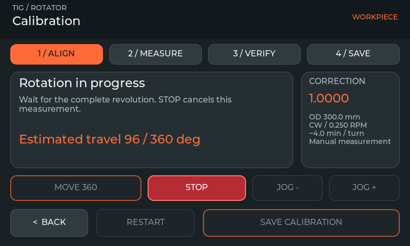
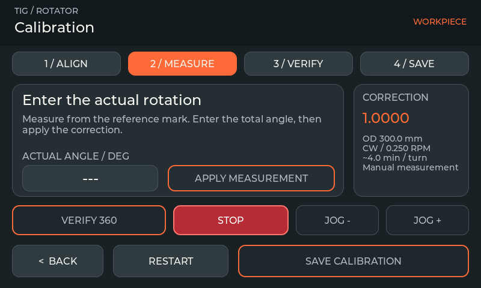
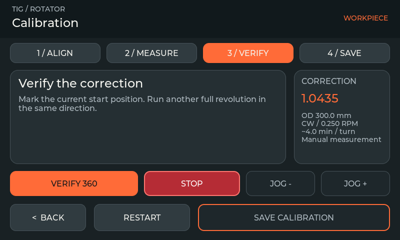
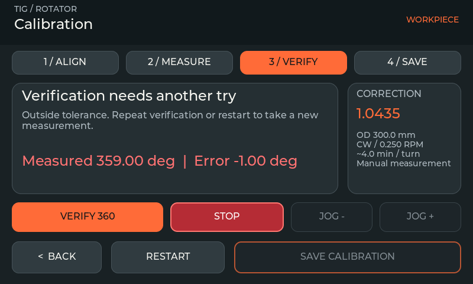
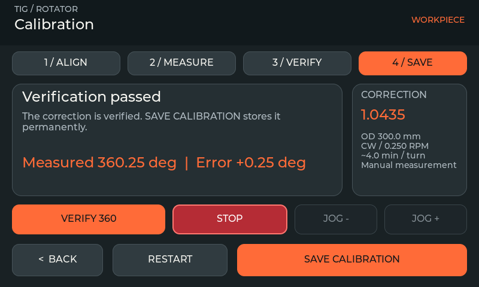
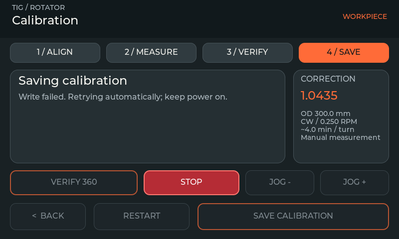
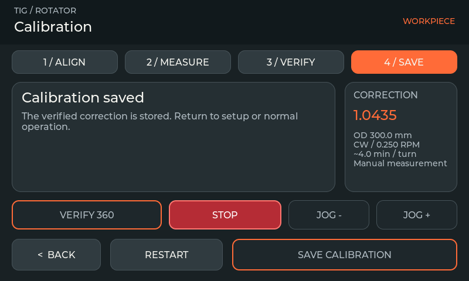

# Workpiece calibration

The calibration workflow is included in v2.1.1 firmware and simulator. These current source captures also show the v2.2.0 text/input refinements. They are actual 800 × 480 LVGL 9.6 simulator captures, using the V5 dark graphite/orange design. The simulator validates interaction and state transitions; the operator must measure the real workpiece.

## Align

Open **Settings → Calibration**. Set the outside diameter directly on this page. Match the drive's microstep switches to Motor Config beforehand. Use hold-to-run **JOG − / JOG +** to align a clear reference mark, then select **MOVE 360**. The default test speed is 0.25 RPM, capped by the configured maximum; one revolution takes about four minutes at 0.25 RPM.

Navigation does not initiate motion. Pedal starts and unrelated program/mode requests are inhibited while calibration is open. Normal software **STOP** remains visible; use the physical E-STOP switch when required.

## Measure

Wait for a completed revolution. Measure the total actual rotation, including overshoot. Tap the angle field, enter the measurement and select **APPLY MEASUREMENT**. Both decimal point and comma are accepted. Values must be finite and between 0.5 and 720 degrees; trailing text is rejected.

The draft correction is `previous factor × 360 / measured angle`. A result outside 0.5–1.5 is rejected with an explanation rather than silently limited. Check diameter, gearing, roller contact and the measurement before restarting. The saved correction is the starting value; Restart does not reset it to 1.0.

## Verify

Mark the current start position, then select **VERIFY 360** in the same direction. Enter the actual angle after this second completed move. Save becomes available only within **360 ± 0.5 degrees**. A failed result can be verified again or restarted for a new correction.

The controller must report exactly one additional completed Step move and idle state before accepting either measurement. STOP, a fault, stale controller status, timeout or changed direction/microstep context invalidate an interrupted move. Save also checks diameter and the active factor. A STOP transition to idle cannot count as a completed revolution.

## Save

Select **SAVE CALIBRATION** after a passing verification. Until then, the correction is a runtime draft, excluded from saved settings and other autosaves. Leaving or restarting discards it once the controller is idle. Existing presets and stored settings retain their format.

Wait for **Calibration saved**, which requires the matching storage receipt. Failed writes retry automatically; keep power on. Back and Restart are disabled while saving. STOP still requests a normal stop without losing the pending save confirmation.

The page has no scrolling: four progress indicators, one instruction/input stage, a context card and fixed controls. The numeric editor uses the full screen. Disabled controls are dimmed. Estimated progress is derived from motor pulses and is not a physical angle sensor. Roller slip, backlash and measurement error still require real-world assessment.

## Regression evidence

459 native/control/speed/storage cases include the actual calibration module, session policy and production dispatcher. Cases cover interrupted/rejected moves, timeout and clock wrap, context changes, strict parsing, correction bounds and draft isolation. The actual LVGL self-test additionally checks interrupted motion, failed verification, successful verification, failed storage/retry and STOP during saving. The layout audit reports zero failures. Firmware builds pass for release, debug and mirror; the functional pre-release build was flash-verified. On 2026-10-05 the owner confirmed the assembled functions work, including the pedal/ADS1115 (detected at 0x48; owner-verified on hardware with the master pedal fix). Quantitative calibration and stop-time results were not supplied.
