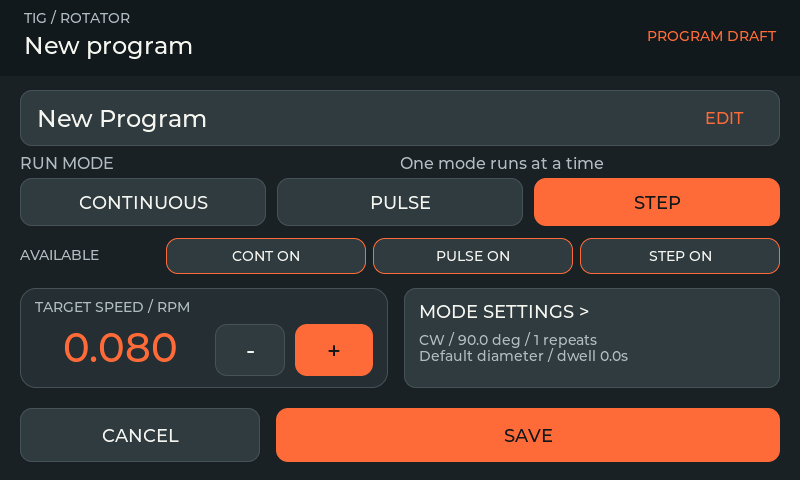
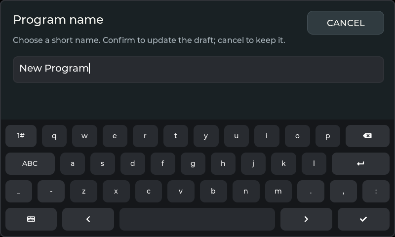
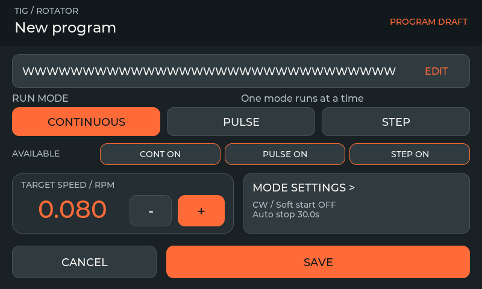
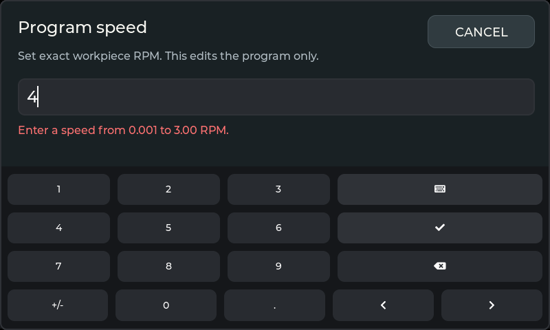
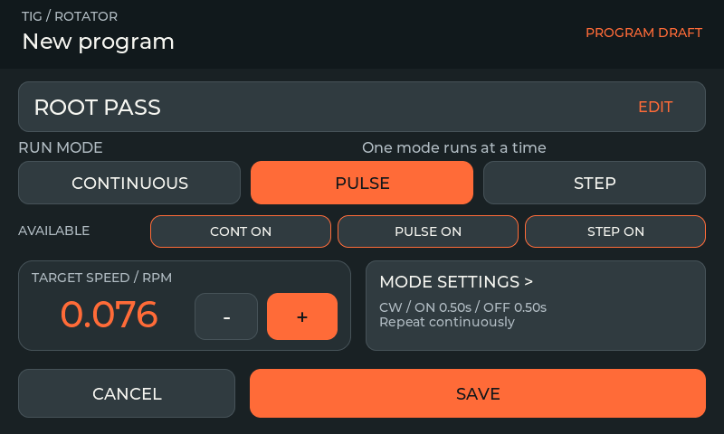
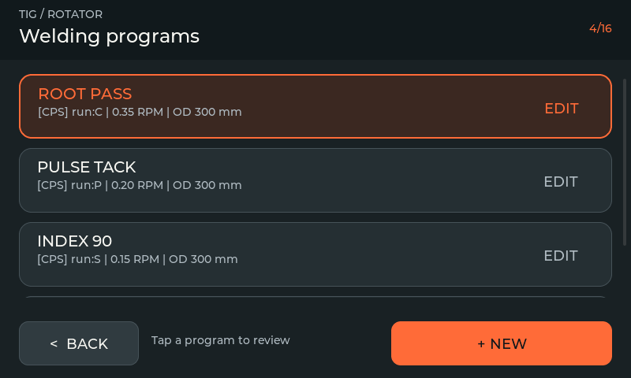

# Program editor (unreleased v2.1.1 source)

The editor uses the existing V5 palette at 800×480, with no page scrolling. These captures come from the actual LVGL 9.6 simulator, not design mockups. The published v2.1.0 downloads retain their original editor.

## Create or edit

Open **Programs → + NEW**, or edit an existing slot. The top field opens the name keyboard. **RUN MODE** selects Continuous, Pulse or Step. Selecting the same mode again leaves it selected. **AVAILABLE** controls which other modes are offered for this preset; the active run mode is always included.

## Name and exact speed

Tap the name, edit it, and use the keyboard's confirm key or the visible **CANCEL** button. Leading/trailing spaces are trimmed. An empty confirmed name becomes `Untitled`. The existing stored name field allows 31 UTF-8 bytes; oversized input displays an error rather than truncating a character. Long ASCII names use a smaller summary font.

Tap the RPM value to enter exact speed. Dot and comma decimal separators are accepted. The whole entry must be numeric and within `MIN_RPM` and the configured maximum; invalid input leaves the editor open and preserves the draft. Summary and mode-settings +/− use **0.001 RPM below 0.1**, and **0.01 RPM otherwise**. Display precision follows the same rule.

## Mode settings and saving

**MODE SETTINGS** opens the selected mode's direction/timing controls. Save there returns updated values to the draft; Cancel retains the previous draft values. Neither operation starts motion or writes the program itself.

The main editor's **SAVE** adds/replaces the preset and queues its existing debounced NVS save. The Programs list exposes the existing save/error status; returning to the list alone is not proof of durable storage. **CANCEL** discards the editor draft. Existing slots additionally offer **DELETE** with confirmation. The list remains limited to 16 programs.

## Validation

`--self-test` covers the actual editing flow, all three low-speed sub-editors, numeric and UTF-8 limits, repeated mode selection, availability, save/cancel and keyboard cleanup. `--program-preview <directory>` runs the same regression and exports these seven states. `--audit-layout` checks registered screens, including the editor footer/mode positions. Real touch and motion are not exercised by these PC checks.
