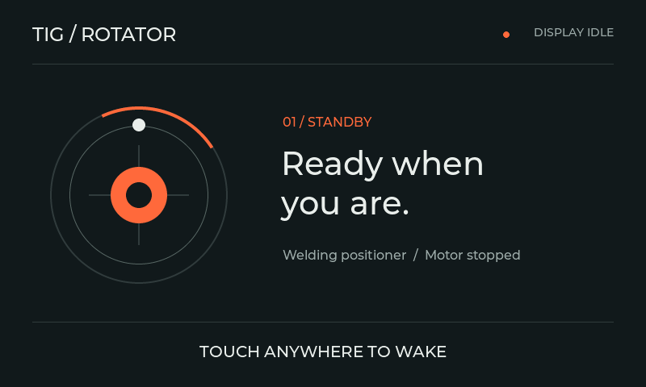

# Idle screen saver (v2.2.0)



The screen saver uses the V5 graphite/orange palette, English labels and flat graphics without shadows. A marker moves around the rotator ring every four seconds; the central composition also shifts slightly. It does not display an invented clock or measured RPM.

## Settings and waking

Open **Settings → Display → Screen saver after**. Choose **OFF, 30s, 1m, 2m or 5m**, then **SAVE**. This reuses the existing saved dim timeout; no settings migration is required. **PREVIEW** opens the screen saver immediately at normal brightness, including when the automatic timeout is OFF. Automatic activation reduces the backlight to 38/255 and restores the configured brightness on wake.

The first touch only wakes the display. The entire press is consumed until release, so holding a finger over START cannot start rotation. A subsequent deliberate touch operates the UI normally. The same filter serves the touchscreen, USB mirror and simulator inputs. Physical input activity also wakes the display; physical controls keep their existing behavior.

The previous page stays loaded underneath. Waking does not navigate, save changes, reset a fault or issue a motion command.

## When it stays awake

Automatic activation is limited to idle navigation/status pages: Main, Menu, Run Modes, Settings, Display, About, System Info and Diagnostics. It remains off during motion (including pulse pauses and stopping), setup, calibration, editing, confirmation dialogs, input overlays, stale control status and pending/failed storage writes. Fault/E-STOP overlays take priority and restore normal brightness. PREVIEW is disabled when these conditions prevent activation.

All widget changes run in the UI task under the LVGL lock. Touch-controller read failures do not release the wake-consumption latch; a successful release sample is required.

## Verification

The simulator self-test covers timeout activation, OFF, preview, held-touch consumption through actual LVGL pointer hit testing over START, a second deliberate START touch, external motion start, physical wake requests, E-STOP priority, stale status, editing/commissioning exclusion, failed storage and repeated theme/overlay recreation. The capture checks text bounds and absence of shadows. The simulator records backlight commands but does not emulate physical LCD brightness.

Build the simulator, then run:

```powershell
.\simulator\build\rotator_simulator.exe --screensaver-preview .pio\screensaver-preview
```

This also exports BMP captures of the screen saver, its movement, the restored main page, E-STOP priority and Display settings. Real GT911 touch, physical backlight behavior and USB mirror wake should be checked on the controller before treating hardware behavior as verified.

Local validation on 2026-10-03: 459 native/control/speed/storage tests passed; the complete simulator self-test and dedicated screen-saver preview passed; the all-screen layout audit reported zero failures; release, debug and USB-mirror firmware compiled successfully. The pre-release functional build at commit 673e078 was subsequently uploaded to the owner's ESP32-P4, its flash data verified, and no serial error output was observed during a 10-second check. On 2026-10-03 the owner confirmed that all currently assembled controller functions work. Pedal/ADS1115 wiring and commissioning were completed on 2026-10-05 (ADS1115 detected at 0x48; GPIO33 switch + analog speed owner-confirmed working with the master pedal fix). This is owner-reported functional confirmation; no quantitative stop-time, calibration-accuracy, rendering or HF test measurements were supplied.
