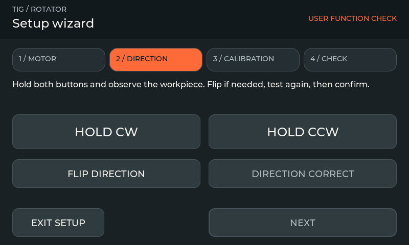
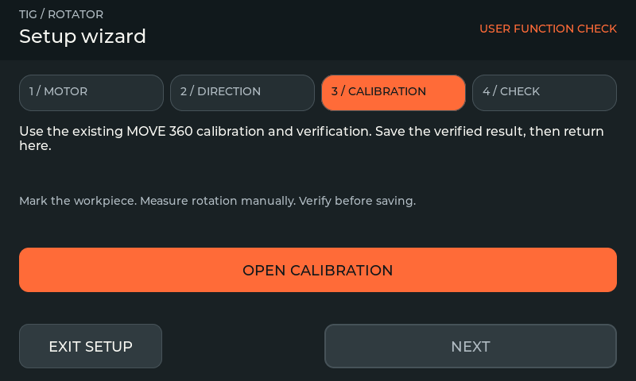
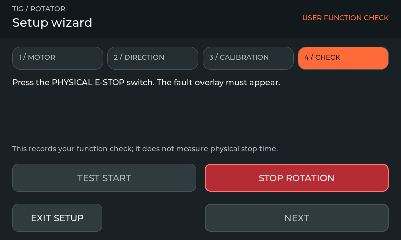
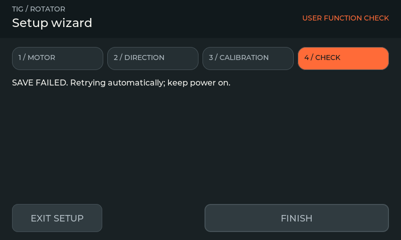
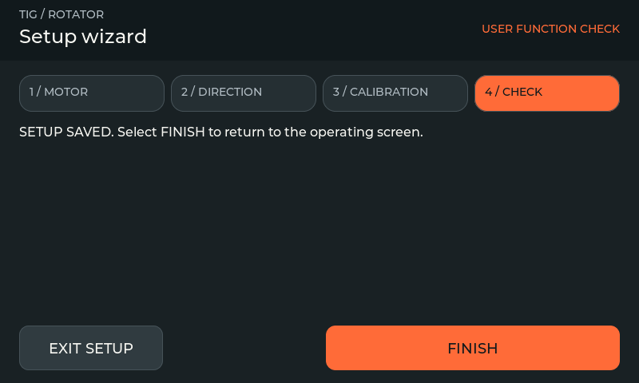

# Setup Wizard

This is an unreleased source feature. The published v2.1.0 firmware and simulator do not include it. The existing V5 operating-screen design is retained.

New installations open the wizard after boot. Existing valid settings without `setup_completed` migrate as configured and retain all settings/presets. Open **Settings → Setup Wizard** to run it voluntarily. An interrupted, incomplete new setup is offered again on restart. Exiting stops any requested motion and keeps settings already saved; it does not reset the machine configuration.

## 1. Motor

Select Standard or DM542T timing, then open Motor Config. Match the microstep setting to the physical drive switches. Set acceleration and maximum RPM, then **SAVE & APPLY**. Continue only after the settings are applied and saved. Gear ratio and default roller/workpiece diameters are shown as fixed project values, not new editable settings.

## 2. Direction

Hold **HOLD CW** and **HOLD CCW** separately and observe the actual workpiece. Releasing either button stops jog; missing hold renewal also stops it. Test speed is 0.1 RPM, capped by configured maximum. If needed, select **FLIP DIRECTION**, wait for the configuration save, and test both directions again. Select **DIRECTION CORRECT** while idle to confirm your observation.

## 3. Calibration

Open the existing calibration screen. Mark the workpiece, explicitly select **MOVE 360**, enter the measured angle, apply the measurement, then run the verification move. Enter the verification angle and save only after verification passes. Return to the wizard after **RESULT SAVED**. Navigation never initiates a calibration movement.

## 4. Function check

Press the **physical E-STOP switch**. The fault overlay blocks operation. Release the switch, inspect the machine and select **RESET TO IDLE**. Reset does not start movement. Explicitly select **TEST START**, observe rotation and select **STOP ROTATION**. Confirm that the workpiece physically stops before continuing. The screen STOP is a normal software stop; it is not a substitute for the physical E-STOP.

The wizard observes input and controller-state sequences; **NEXT is your confirmation of the physical function check**. It does not measure electrical/mechanical stop time or certify the machine. Pedal starts are inhibited throughout commissioning.

## Completion and failed saves

Completion is confirmed only when its settings-save generation is committed. A failed save displays the error and retries automatically; FINISH remains disabled until persistence succeeds. Keep power on during retry.

No automatic motion starts on completion. Reopening the wizard begins a fresh set of checks without clearing existing motor settings or programs.
